# Wikiscore meets *l'Abate Portoghese*
<!-- _backgroundColor: "lightcyan" -->

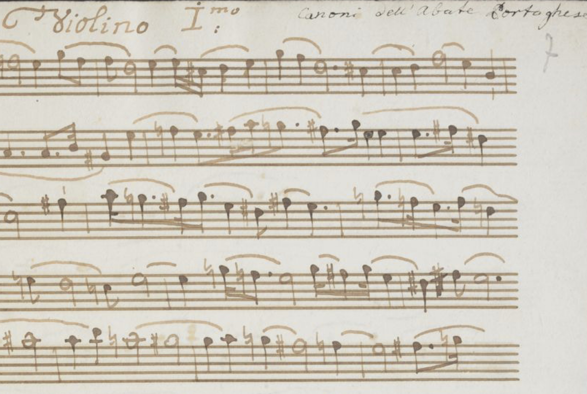

JN Oliveira

March 31st, 2023

**[Musicology Days](https://www.uminho.pt/PT/siga-a-uminho/Paginas/Detalhe-do-evento.aspx?Codigo=61278)**, UMinho, Braga

---

# *L'Abate Portoghese*
<!-- _backgroundColor: "lightcyan" -->
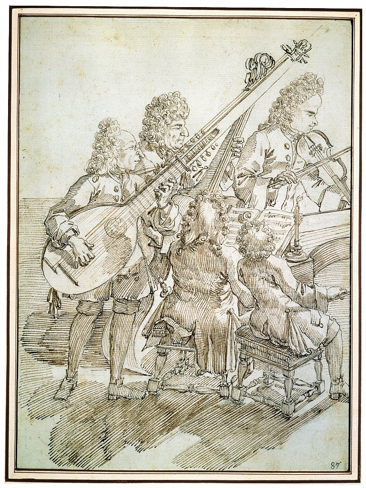

* Abott **António da Costa** (1714-1780?) was a Portuguese musician who, born in the Porto region, left the country in 1749 for Rome.

* Travelling to Venice and Paris, he eventually settled in Vienna, where he is thought to have died around 1780.

* Misantrope, he despised the positions offered to him, living most of his life in poverty.

* His intelligence and idiosincratic behaviour attracted the attention of the high nobility, in whose salons he sometimes played his compositions for violin or guitar. 

---

# *L'Abate Portoghese*
<!-- _backgroundColor: "lightcyan" -->
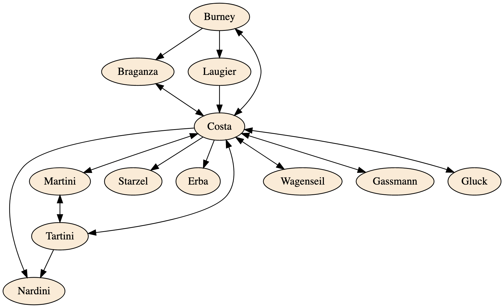

Documented musical connections in **Italy** and **Vienna**.

(among others)

---

# Sources
<!-- _backgroundColor: "lightcyan" -->
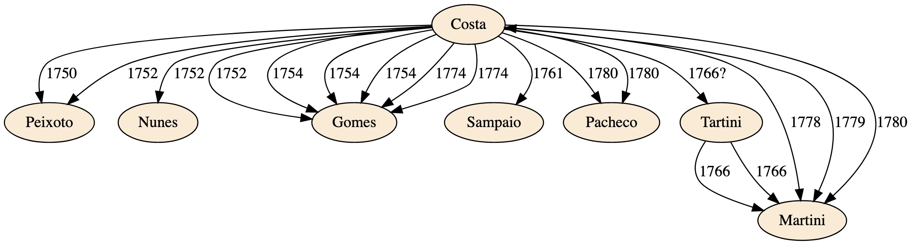

* 13 Letters (1750-1780) published by J. Vasconcelos (1879)
* Charles Burney travel diary (1772)
* 5 Letters exchanged between Costa, Martini and Tartini (1766-1780)

---

# 1749-1750
<!-- _backgroundColor: "lightcyan" -->

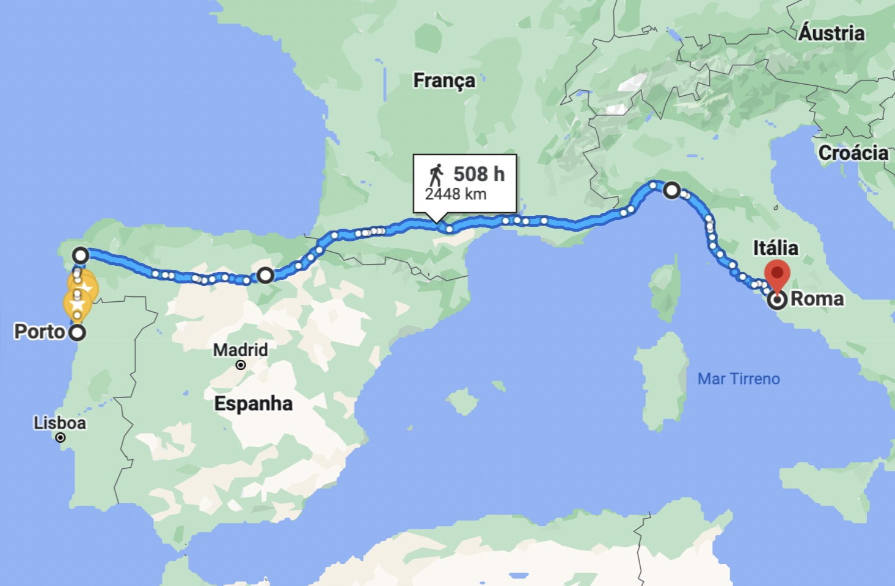

> "*Pedi um passaporte em Santiago e não mo deram (...) e duas vezes estive preso (...) não posso dizer n'uma carta o que passei em quatro mezes (...) de vida de novellas (...)*"

(Letter I, 1750)

---

# Rome   (1750-1754)
<!-- _backgroundColor: "lightcyan" -->

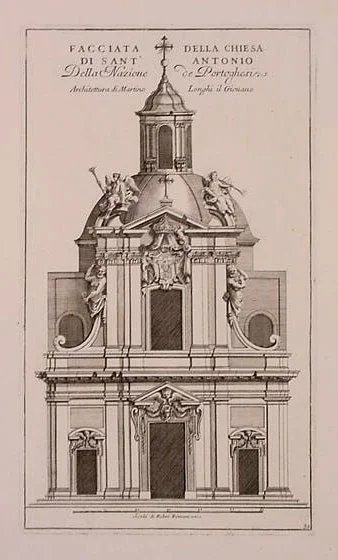

At [*Sant’Antonio dei Portoghesi*](http://www.ipsar.org/)

> "*(...) estou conego com casa e cama, e cozinha de casa, e três mil réis cada mez pela cantarola (...)*"

(Letter VII, 30 Aug. 1754)

---

# Rome   (1750-1754)
<!-- _backgroundColor: "lightcyan" -->

**Trios** sent to Porto:

>  “*(…) here are two [trios] to join the others and make half a dozen*” (“*ahi vão dous para ajustar com os outros a meia duzia*”). 

(Letter II, 28 Feb. 1752)

---

# Rome   (1750-1754)
<!-- _backgroundColor: "lightcyan" -->

**Trios** sent to Porto:

>  “*(...) os outros que lá estão são mais enternecidos; estes são melhores para quando uma pessoa tem o coração mais aliviado de amores, mas nem por isso deixam de confortar o peito*".

(Letter II, 28 Feb. 1752)

---

# Rome   (1750-1754)
<!-- _backgroundColor: "lightcyan" -->

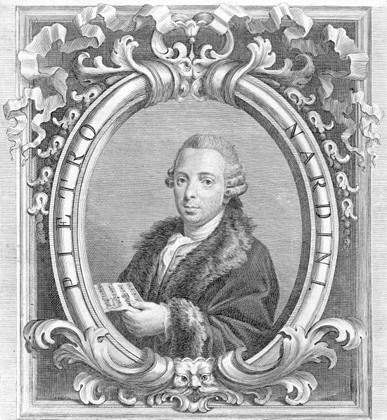

> "*O Bravo de Leorne chama-se o Senhor [Nardini](https://en.wikipedia.org/wiki/Pietro_Nardini); acompanhei-lhe quatro sonatas a solo em casa do Cardeal Spinelli que está aqui vezinho (...)*"

(Letter III, May/June 1752)

---

# Venice (1761-1766)
<!-- _backgroundColor: "lightcyan" -->

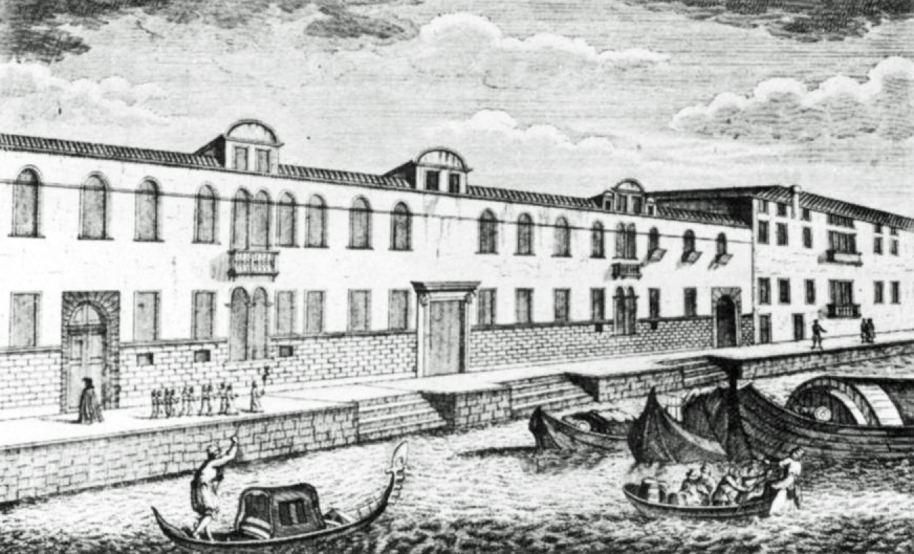

1760 diplomatic crisis: all Portuguese to leave Rome.

> "*De Veneza (...) tornar-lhe-hei a dizer que esta terra no material é differentissima do que lá se crê (...)*"

(Letter VIII, 23 Jul. 1761)

---

#  Tartini to Martini
<!-- _backgroundColor: "lightcyan" -->
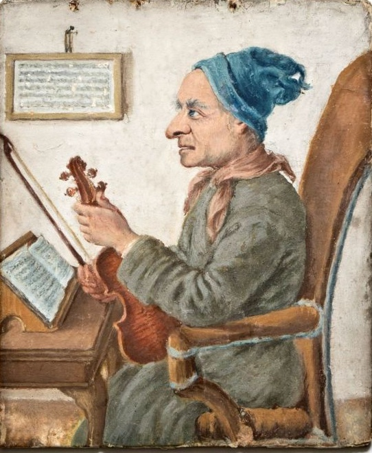

> "*What Your Reverence now writes to me about Signor Don Antonio Costa (this is his surname) does not surprise me; for you can imagine that the initial impact of such a novelty, namely this attempt at a music always in inversion, we have received here with much greater force from his guitar, where the effect is truly unique (...)*"

>  "*He is a patron and friend of mine*".

Letter 162. Padua, 20 Sep. 1766

---

#  Tartini to Martini
<!-- _backgroundColor: "lightcyan" -->

> "*From Signor Dottor Antonio Costa I have received, as per your order, three compositions of him: a solo, a duet and a trio. I ask Your Reverence to instruct me on how to send them to you, and you shall be obeyed. He has had the pleasure and honour of serving you, and is full of esteem and admiration for Your Reverence (...)*"

Letter 165. Padua, 17 Oct. 1766

---

# Tartini: Sonate B.A4 "Chitarra portoghese"
<!-- _backgroundColor: "lightcyan" -->
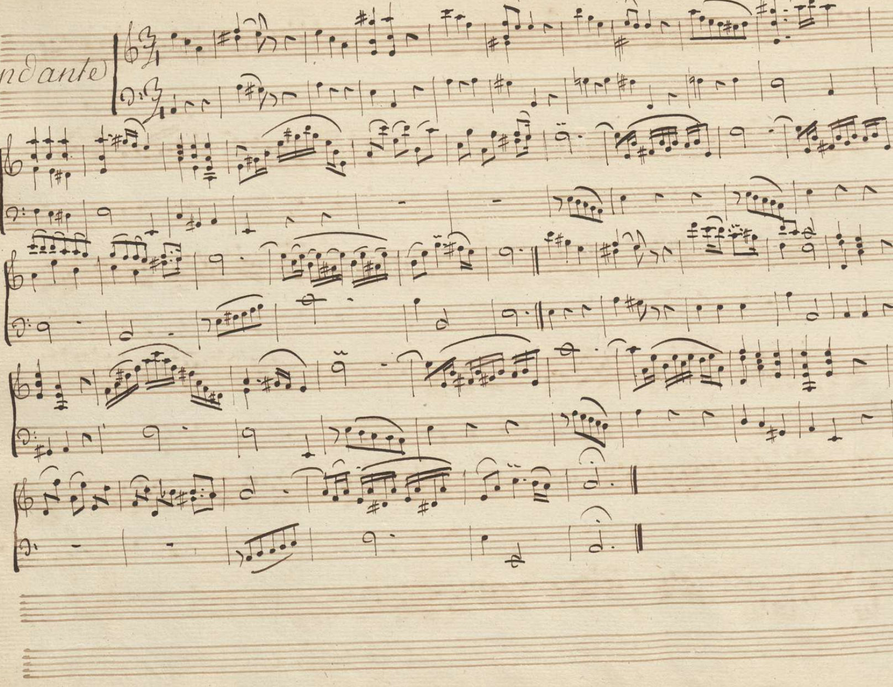

Inscription on [Berkeley](https://opac.rism.info/metaopac/search?View=rism&id=138631&View=rism)'s manuscript copy:

>  "*Sonata à Violino, e Basso / Del / Sig.r Giuseppe Tartini / Composta dal Medes.mo / Sopra lo stile che suona / il Prette dalla Chitarra / Portoghese*"

*("in the style sounding like the guitar of the Portuguese priest")*

Aside :arrow_forward: [Berlin's copy](https://digital.staatsbibliothek-berlin.de/werkansicht?PPN=PPN104710864X&PHYSID=PHYS_0090&DMDID=DMDLOG_0029) (Andante).

---
# Vienna (1772-1780)
<!-- _backgroundColor: "lightcyan" -->
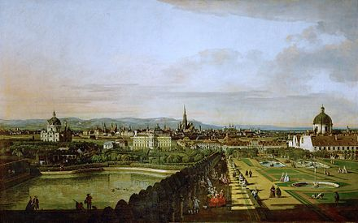

---
# Charles Burney (Vienna, 1772)
<!-- _backgroundColor: "lightcyan" -->

From his travel diary (pag. [259](https://books.google.pt/books?id=a0lptAEACAAJ&printsec=frontcover&hl=pt-PT&source=gbs_ge_summary_r&cad=0#v=onepage&q=259&f=false)):

> "*But before we set out, the **duke of Braganza** (...) came in; lord Stormont did me the honour to present me to his highness, who is an excellent judge of music (...)*" 

> "*His royal highness gave me an account of a Portuguese Abbé (...)* [who is] *a kind of Rousseau, but still more original (...)*"

---

# Charles Burney (Vienna, 1772)
<!-- _backgroundColor: "lightcyan" -->
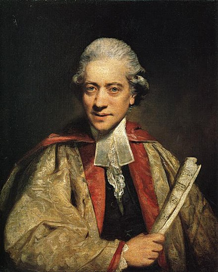

From his travel diary (pag. [287](https://books.google.pt/books?id=a0lptAEACAAJ&printsec=frontcover&hl=pt-PT&source=gbs_ge_summary_r&cad=0#v=onepage&q=287&f=false)):

> *"This Abate is the extraordinary musician that I mentioned before who disdaining to follow the steps of others has struck out a new road both as composer and performer which it is wholly impossible to describe (...)"*

---

# Vienna (1772)
<!-- _backgroundColor: "lightcyan" -->
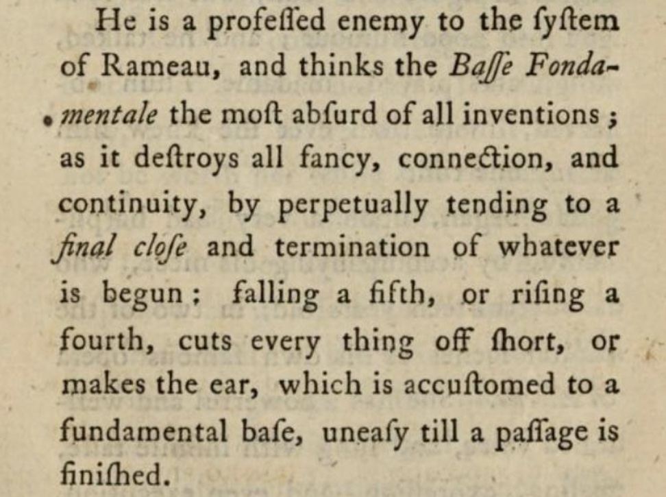

Burney (page [261](https://books.google.pt/books?id=a0lptAEACAAJ&printsec=frontcover&hl=pt-PT&source=gbs_ge_summary_r&cad=0#v=snippet&q=261&f=false)): 

> *"(...) he is a professed enemy to the system of Rameau, and thinks the Basse Fondamentale the most absurd of all inventions (...)"*

---

# Vienna (1772-09-04)
<!-- _backgroundColor: "lightcyan" -->
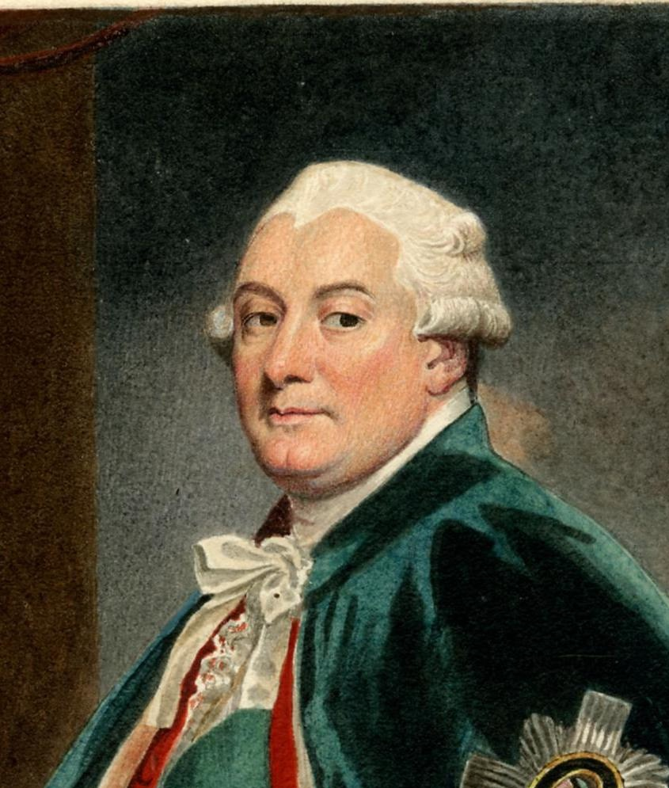

Burney (pag. [287](https://books.google.pt/books?id=a0lptAEACAAJ&printsec=frontcover&hl=pt-PT&source=gbs_ge_summary_r&cad=0#v=onepage&q=287&f=false)):

> "*The musical party which dined today at lord [Stormont](https://en.wikipedia.org/wiki/David_Murray,_2nd_Earl_of_Mansfield#Public_life)'s was select and in the highest degree entertaining and pleasing. It consisted of the Prince Poniatowski, duke of Braganza, the Portuguese minister, count and countess Thun, M. L'Augier, the chevalier madame and mademoiselle Gluck, the Abate Costa &c."*

---

# Vienna (1772-09-04)
<!-- _backgroundColor: "lightcyan" -->

Burney (pag. [282](https://books.google.pt/books?id=a0lptAEACAAJ&printsec=frontcover&hl=pt-PT&source=gbs_ge_summary_r&cad=0#v=snippet&q=282&f=false)):

> *"(...) all I can say of his productions is that in them melody is less attended to than harmony and uncommon modulation;  and that the time is always difficult to make out from the great number of ligatures and fractions. (...)"*

> "*He played two movements on his guitar before dinner the subjects of which as nearly as I can remember were these:*" 

---

# Vienna (1772-09-04)
<!-- _backgroundColor: "lightcyan" -->
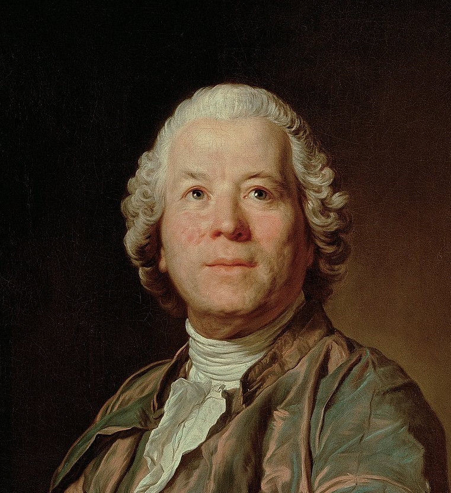

Burney (pag. [290](https://books.google.pt/books?id=a0lptAEACAAJ&printsec=frontcover&hl=pt-PT&source=gbs_ge_summary_r&cad=0#v=snippet&q=290&f=false)):

> *"(...) I sat between this Abate and the chevalier [Gluck](https://en.wikipedia.org/wiki/Christoph_Willibald_Gluck), during dinner, and we all three talked more than we eat (...)"*

---

# Vienna (1772-09-04)
<!-- _backgroundColor: "lightcyan" -->
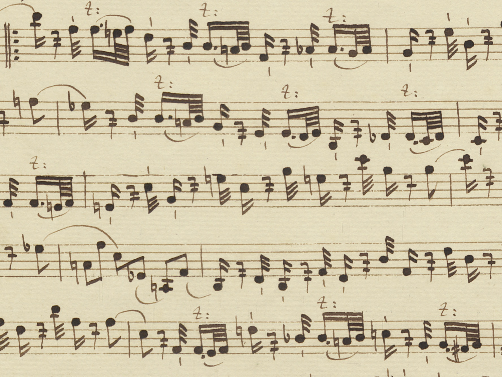

Burney (pag. [292](https://books.google.pt/books?id=a0lptAEACAAJ&printsec=frontcover&hl=pt-PT&source=gbs_ge_summary_r&cad=0#v=snippet&q=292&f=false)):

> *"(...) After dinner, a duet, for two violins, by the Abate, was tried by himself and M. Startzel, an excellent player;*"

> *"(...) but the Abate Costa's duo was so difficult, both in time and style, that it was never well performed after twenty of thirty trials. (...)"*

---

# Vienna (1779-80)
<!-- _backgroundColor: "lightcyan" -->
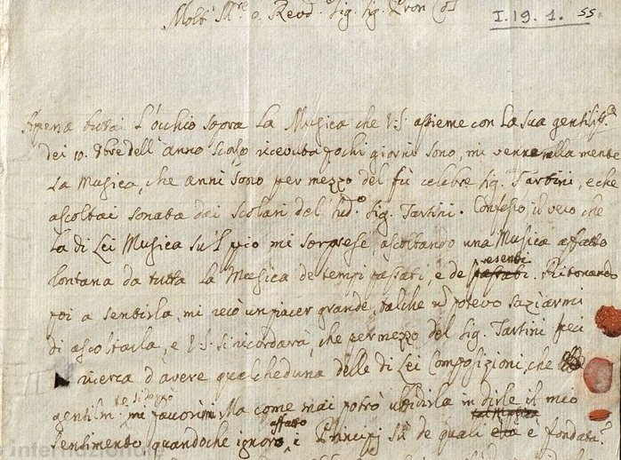

[Letter](http://www.bibliotecamusica.it/cmbm/scripts/lettere/scheda.asp?id=2790)  from Martini to Costa:

> "*As soon as I laid eyes on the score (...) came to my mind the music that years ago, through the famous Signor Tartini (...) I heard (...). I confess that your music surprised me at first, far removed as it is from all the music of the past and present. Afterwards, listening to it again gave me great pleasure (...)*"

2 Jan. 1779

---

# Vienna (1779-80)
<!-- _backgroundColor: "lightcyan" -->

[Letter](http://www.bibliotecamusica.it/cmbm/scripts/lettere/scheda.asp?id=2790)  from Martini to Costa:

> "*(...) so much so that I was not satisfied with listening to it, and Your Excellency will remember that through Mr. Tartini I searched for some of your compositions (...) But how can I obey you to tell my feelings when I am completely ignorant of the principles on which they are based?*"

2 Jan. 1779

---
# Vienna (1779-80)
<!-- _backgroundColor: "lightcyan" -->
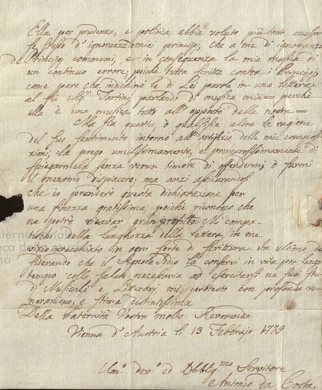

[Letter](http://www.bibliotecamusica.it/cmbm/scripts/lettere/scheda.asp?id=2791) from Costa to Martini:

*(...) though I write without principle, I must tell you first of all that, if I compare my music with that of any composer, I believe that his is shaped, like mine, by the orientation of the ear, with the only difference that perhaps in his it does not always belong to him, but to those who made the principles on which his music is based.*"

13 Feb. 1779

---

# Scarlatti
<!-- _backgroundColor: "lightcyan" -->
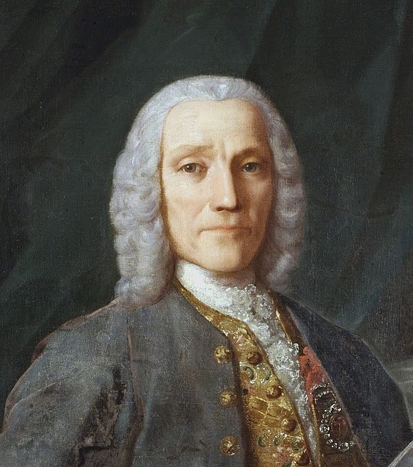

Scarlatti to Laugier:

> "*(...) Scarlatti frequently told M. L'Augier, that he was sensible he had broke through all the rules of composition in his lessons; but asked if his deviations from these rules offended the ear? (...)*"

(Burney, page [253](https://books.google.pt/books?id=a0lptAEACAAJ&printsec=frontcover&hl=pt-PT&source=gbs_ge_summary_r&cad=0#v=onepage&q=scarlatti&f=false))

---
<!-- _backgroundColor: "lightcyan" -->
# Leipzig (1790)
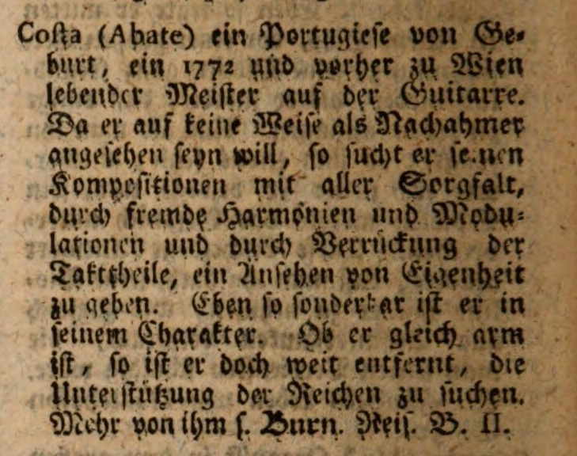

Abate Costa's entry in Gerber's "*Lexikon der Tonkünstler (...)*"

> [Ernst Ludwig Gerber](https://en.wikipedia.org/wiki/Ernst_Ludwig_Gerber), *Historisch-biographisches Lexikon der Tonkünstler*, volume I, page [304](https://www.digitale-sammlungen.de/en/view/bsb11011752?page=204,205). 
> Breitkopf, Leipzig, 1790 

Source :arrow_forward: München, [Bayerische Staatsbibliothek](https://www.digitale-sammlungen.de/en)

---

# Style
<!-- _backgroundColor: "lightcyan" -->

* Difficult fractions (rythm)
* One sole register ($G$-clef)
   * Continuous flow
   * Crossings
* Free imitative style
* Unusual modulations 
* Dissonances beyond tolerated at the time
* Ties versus spicatto notes
* Several occurrences of "$\flat\natural$" (??)

--- 
# Style
<!-- _backgroundColor: "lightcyan" -->

Ciacchi & Dellaborra ([2020](https://sidm.it/ojs/index.php/fmi/article/view/1044)):

> "*To the ear, the effect is in some points astounding, so much as it is unpredictable, but convincing; in others, vice versa, it is incomprehensible and it seems that the succession of sounds is not determined by logic, but by the pure desire to amaze*".

> "*It is certain that Costa's catalog is not complete. (...) Curious character and musician outside the box of the time, Antonio da Costa is still waiting for an overall and documented judgment on his work.*"

---

# Known works
<!-- _backgroundColor: "lightcyan" -->

* Trios I, II, III (lost?)
* Trios IV, V e VI - *Drei Sonaten für drei Violinen* ([Austrian National Library](https://www.onb.ac.at/beethoven-digital/portal/)) ([Wikiscore](http://wiki-score.org/doku.php?id=costa:index))
* Minuet mentioned in Letter VI - most probably lost
* *Duet in e$\flat$ for 2 violins* ([Staatsbibliothek zu Berlin](https://stabikat.de/Record/1698231105)) ([Wikiscore](http://wiki-score.org/doku.php?id=abbate:index))
* *Mottetto a quattro Voci / *Bone Pastor* / Dell'Abb:te Costa Portoghese, Partit.: S, A, T, B, org; 4V (SATB), bc - Fa I-Vsm* Fondo Procuratoria di San Marco,
[scheda n° 569. B.660/1-5](https://archivio.fondazionelevi.it/record/30922?ln=en)
* *O vos omnes qui transitis per viam* a 5 soprani soli in Fm, source: [Ciacchi & Dellaborra 2020](https://sidm.it/ojs/index.php/fmi/article/view/1044)
* *O vos omnes qui transitis per viam* a 4 soprani con accompagnamento di 4 violini in cm, source: [Ciacchi & Dellaborra 2020](https://sidm.it/ojs/index.php/fmi/article/view/1044)

---

# Wikiscore
<!-- _backgroundColor: "lightcyan" -->
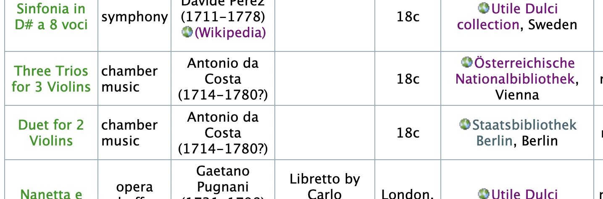

[:arrow_forward:](http://wiki-score.org/doku.php) wiki-score.org

A platform similar to the Wikipedia for cooperative editing of music scores

---

# Current research
<!-- _backgroundColor: "lightcyan" -->
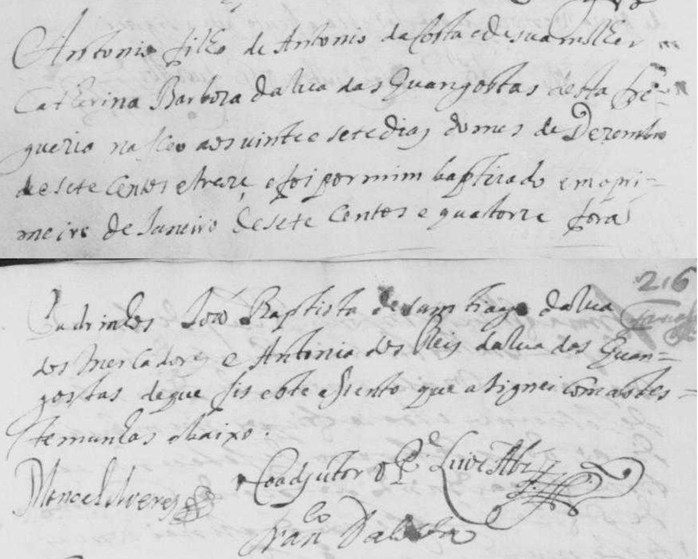

## 1714-1749?

Possible birth record:

> Porto, [parish of Sé](https://pesquisa.adporto.arquivos.pt/ViewerForm.aspx?id=490863)
Born: 1713-12-27
Baptized: 1714-01-01

Other alternatives found but less likely.

:arrow_forward: Needs further research.

---
# Current research
<!-- _backgroundColor: "lightcyan" -->
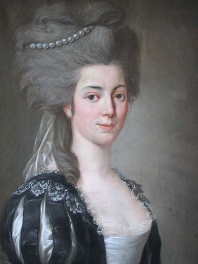

Death possibly mentioned in the letters of [Leonor de Almeida](https://en.wikipedia.org/wiki/Leonor_de_Almeida_Portugal,_Marquise_of_Alorna) (Countess of Oyenhausen)?

She met him and was living in Vienna when he died:

> "(...) *Falei já com a fidalga três vezes e bastante mas não tanto quanto é necessário para formar conceito dela com acerto; (...) ; faz bem versos; sabe francês italiano inglês latim e já principia a entender alemão*”.

(Letter XIII, 1780)

---
# Current research
<!-- _backgroundColor: "lightcyan" -->
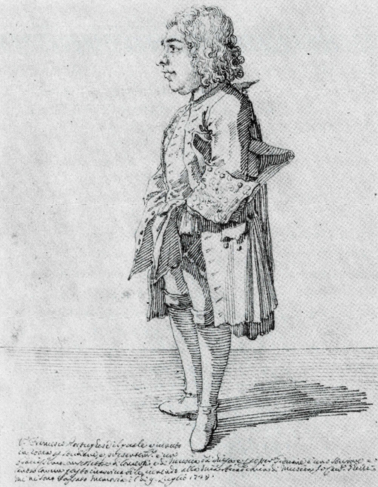

Possibly caricatured by Ghezzi in Rome?

> [Pier Leone Ghezzi](https://en.wikipedia.org/wiki/Pier_Leone_Ghezzi) (1674-1755) was a very prolific artist.

Aside: Ghezzi's caricature of [Francisco A. Almeida](https://en.wikipedia.org/wiki/Francisco_Ant%C3%B3nio_de_Almeida)

What about his **portrait** sent from Vienna in 1780...?

> "(...) [A] *respeito do retrato (...) é possível que V.M. já o tenha em mão (...) O portador é o Snr. Padre Francisco Brandão (...) o qual V.M. ha de procurar em Miragaia (...)*”.

(Letter XIII,  7 Oct. 1780)

---

# The "Porto gang"
<!-- _backgroundColor: "lightcyan" -->

What about the "*palestra do Nunes*", the group of partners that Costa left behind in 1749 and to whom he sends his music?

> Violinists João Peixoto, António Vieira, António Nunes, Thomas Bark, Canner, ...?

Meanwhile:

> Family [Gomes Costa Pacheco](https://digitarq.arquivos.pt/details?id=7637352) fully identified.

---

# Summary
<!-- _backgroundColor: "lightcyan" -->

Teófilo Braga ([1879](https://purl.pt/63)):

> "*The name of Antonio da Costa, illustrating the Portuguese art and one of the great in this chorus of victims of obscurantism, resurfaces today as a protest in our history. This is why in every sense we will always proclaim the publication of his letters as a national service.*"

Sure! But now it's time to praise him for what, more than anything else, he was:

> a musician, an original **composer**.

---

# References 

* Charles Burney, *The Present State of Music in Germany, the Netherlands, and United Provinces*, in two volumes, London, 1773

* *Cartas curiosas do Abbade António da Costa anotadas e precedidas de um ensaio biográfico de Joaquim de Vasconcellos*, Porto, Imprensa Litterario-Commercial, 1879. 

* Manuel Carlos de Brito, *A Kind of Rousseau but Still More Original”: Novos dados sobre o Abade António da Costa*. In: Estudos de História da Música em Portugal, Lisboa, Estampa, 1989, pp. 139-155

* Andrea Ciacchi, Mariateresa Dellaborra (2020) *António da Costa compositore e commentatore della scena musicale italiana settecentesca*, Fonti Musicali Italiane, 25 (2020), pp.33-60.

<!--
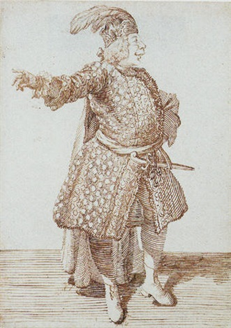
[:arrow_forward:](./abbate-S3.wav)
; as it destroys all fancy, connection, and continuity, by perpetually tending to a final close and termination of whatever is begun: falling a fifth, or rising a fourth, cuts every thing off short, or makes the ear, which is accustomed to a fundamental base, uneasy till a passage is finished"* ->
