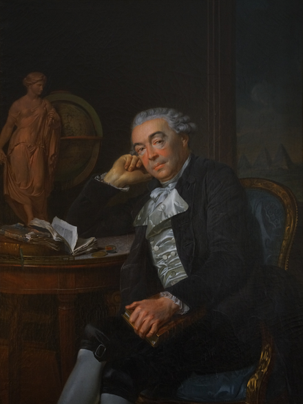
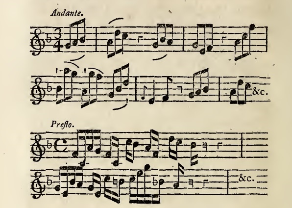

---

marp: true
math: katex
theme: default
paginate: true
footer: 'Wikiscore meets l'Abate Portoghese'
<!-- _backgroundColor: "lightcyan" -->
 
---

# Wikiscore meets *l'Abate Portoghese*
<!-- _backgroundColor: "lightcyan" -->

JN Oliveira

March 31st, 2023

Musicology Days, UM, Braga

## [:arrow_forward:](./abbate-S3.wav)

---

# *L'Abate Portoghese*
<!-- _backgroundColor: "lightcyan" -->

* Abott **António da Costa** (1714-1780?) was a Portuguese musician who, born in the Porto region, left the country in 1749 for Rome.

* Travelling to Venice and Paris, he eventually settled in Vienna, where he is thought to have died around 1780.

* Misantrope, he despised the positions offered to him, living most of his life in poverty.

* His intelligence and idiosincratic behaviour attracted the attention of the high nobility, in whose salons he sometimes played his compositions for violin or guitar. 

---

# *L'Abate Portoghese*
<!-- _backgroundColor: "lightcyan" -->

Documented musical connections.

---

# Sources
<!-- _backgroundColor: "lightcyan" -->

* 13 Letters (1750-1780) published by J. Vasconcelos (1879)
* Charles Burney travel diary (1772)
* 5 Letters exchanged between Costa, Martini and Tartini (1766-1780)

---

# 1749-1750
<!-- _backgroundColor: "lightcyan" -->

> "*Pedi um passaporte em Santiago e não mo deram (...) e duas vezes estive preso (...) não posso dizer n'uma carta o que passei em quatro mezes (...) de vida de novellas (...)*"

(Letter I, 1750)

---

# Rome   (1749-1754)
<!-- _backgroundColor: "lightcyan" -->

At [*Sant’Antonio dei Portoghesi*](http://www.ipsar.org/)

> "*(...) estou conego com casa e cama, e cozinha de casa, e três mil réis cada mez pela cantarola (...)*"

(Letter VII, 1754)

---

# Rome   (1749-1754)
<!-- _backgroundColor: "lightcyan" -->

> "*O Bravo de Leorne chama-se o Senhor [Nardini](https://en.wikipedia.org/wiki/Pietro_Nardini); acompanhei-lhe quatro sonatas a solo em casa do Cardeal Spinelli que está aqui vezinho (...)*"

(Letter III, 1752)

---

# Venice (1761-1766)
<!-- _backgroundColor: "lightcyan" -->

## [:arrow_forward:](./abbate-S3.wav)

---

# Vienna (1772-1780)
<!-- _backgroundColor: "lightcyan" -->

---

# Charles Burney (Vienna, 1772)
<!-- _backgroundColor: "lightcyan" -->

From his travel diary (pag. [287](https://books.google.pt/books?id=a0lptAEACAAJ&printsec=frontcover&hl=pt-PT&source=gbs_ge_summary_r&cad=0#v=onepage&q=287&f=false)):

> *"This Abate is the extraordinary musician that I mentioned before who disdaining to follow the steps of others has struck out a new road both as composer and performer which it is wholly impossible to describe (...)"*

---

# Vienna (1772)
<!-- _backgroundColor: "lightcyan" -->

Burney (page [261](https://books.google.pt/books?id=a0lptAEACAAJ&printsec=frontcover&hl=pt-PT&source=gbs_ge_summary_r&cad=0#v=snippet&q=261&f=false)): 

> *"(...) he is a professed enemy to the system of Rameau, and thinks the Basse Fondamentale the most absurd of all inventions (...)"*

---

# Vienna (1772-09-04)
<!-- _backgroundColor: "lightcyan" -->

Burney (pag. [287](https://books.google.pt/books?id=a0lptAEACAAJ&printsec=frontcover&hl=pt-PT&source=gbs_ge_summary_r&cad=0#v=onepage&q=287&f=false)):

> "*The musical party which dined today at lord [Stormont](https://en.wikipedia.org/wiki/David_Murray,_2nd_Earl_of_Mansfield#Public_life)'s was select and in the highest degree entertaining and pleasing. It consisted of the Prince Poniatowski, **duke of Braganza**, the Portuguese minister, count and countess Thun, M. L'Augier, the chevalier madame and mademoiselle Gluck, the Abate Costa &c."*

---

# Vienna (1772-09-04)
<!-- _backgroundColor: "lightcyan" -->

Burney (pag. [282](https://books.google.pt/books?id=a0lptAEACAAJ&printsec=frontcover&hl=pt-PT&source=gbs_ge_summary_r&cad=0#v=snippet&q=282&f=false)):

> *"(...) all I can say of his productions is that in them melody is less attended to than harmony and uncommon modulation;  and that the time is always difficult to make out from the great number of ligatures and fractions. (...)"*

> "*He played two movements on his guitar before dinner the subjects of which as nearly as I can remember were these:*" 

---

# Vienna (1779-80)
<!-- _backgroundColor: "lightcyan" -->

Letters exchanged with Martini

---

# Vienna (1780)
<!-- _backgroundColor: "lightcyan" -->

Leonor de Almeida (countess of Alorna):

> "(...) *Falei já com a fidalga três vezes e bastante mas não tanto quanto é necessário para formar conceito dela com acerto; (...) ; faz bem versos; sabe francês italiano inglês latim e já principia a entender alemão*”.

(Letter XIII, 1780)

---

# Current research
<!-- _backgroundColor: "lightcyan" -->

Possible birth record:

> Porto, [parish of Sé](https://pesquisa.adporto.arquivos.pt/ViewerForm.aspx?id=490863), 1713-12-27; baptized: 1714-01-01

Other alternatives exist but less likely.

Needs further research.

---

# Current research

Death?

(Other alternatives less likely)

---

# Known works

---

## [:arrow_forward:](./abbate-S3.wav)

![image.j./canoni.jpg)

* Same register ($G$-clef)
   * Free imitative style
   * "Stereophonic" effect?
   * Continuous flow
* Dissonances beyond what was tolerated
* Ties and spicatto ``(x...) .y.z...`` style 
* Difficult fractions (rythm)

 

---

 

 

<!-- ; as it destroys all fancy, connection, and continuity, by perpetually tending to a final close and termination of whatever is begun: falling a fifth, or rising a fourth, cuts every thing off short, or makes the ear, which is accustomed to a fundamental base, uneasy till a passage is finished"* ->
