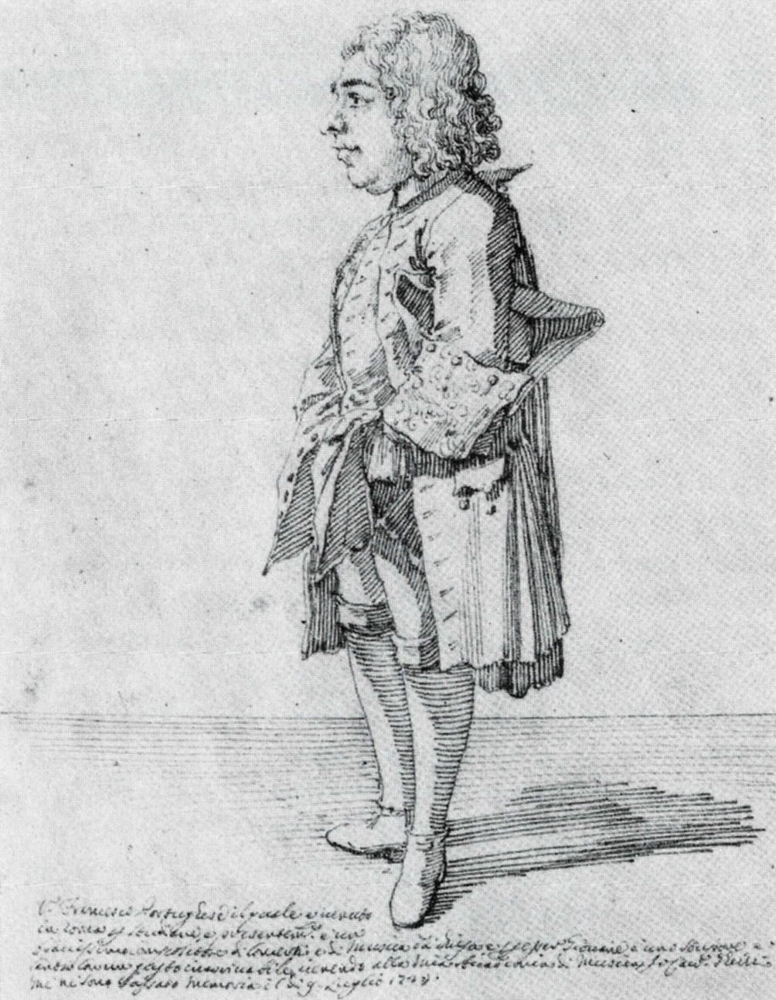
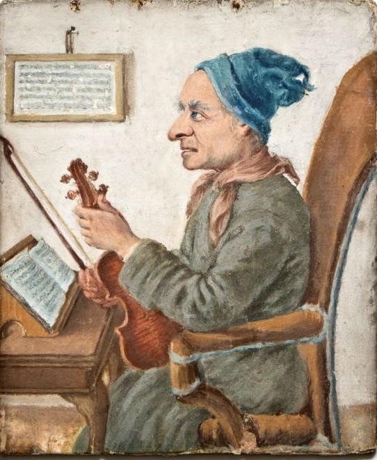
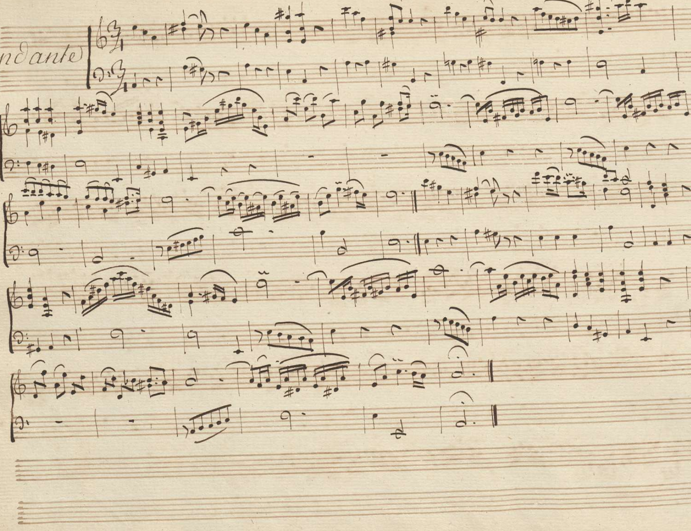
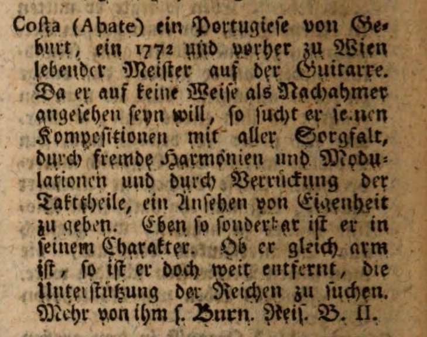
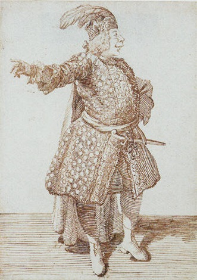

# Who were the friends of Abbot António da Costa in Porto?
<!-- _backgroundColor: "lightcyan" -->

JN Oliveira

May 25th, 2024

**[Symposium Abbot António da Costa, CEHUM](https://www.uminho.pt/PT/siga-a-uminho/Paginas/Detalhe-do-evento.aspx?Codigo=61278)**, UMinho, Braga

---

# *L'Abate Portoghese*
<!-- _backgroundColor: "lightcyan" -->

* Abott **António da Costa** (1714-1780?) was a Portuguese musician who, born in the city of Porto, left the country in 1749/50 for Rome.

* Later travelling to Venice and Paris, he eventually settled in Vienna, where he is thought to have died around 1780.

* Misantrope, he despised the positions offered to him, living most of his life in poverty.

* His intelligence and idiosincratic behaviour attracted the attention of the high nobility, in whose salons he sometimes played his compositions for violin or guitar. 
---

# Sources
<!-- _backgroundColor: "lightcyan" -->

### 13 Letters (1750-1780)
   * Manuscript copy: ANTT [COD. 4296](http://id.bnportugal.gov.pt/bib/catbnp/2137427) (old keys: P-2-18, O-2-18)
   * Studied and published by **J. Vasconcelos** (1879)
   * Commented in depth by Teófilo Braga
   * Re-published by Lopes Graça

---
# Sources
<!-- _backgroundColor: "lightcyan" -->

### **Charles Burney** travel diary (1772)
### 5 Letters exchanged between **Costa**, **Martini** and **Tartini** (1766-1780)
###  Manuscript scores preserved in the archives of Vienna, Berlin and Bologna.
  
---

<!-- _backgroundColor: "lightcyan" -->

---

# First letter (1750)
<!-- _backgroundColor: "lightcyan" -->

> "*Pedi um passaporte em Santiago e não mo deram (...) e duas vezes estive preso (...) não posso dizer n'uma carta o que passei em quatro mezes e tanto de vida de novellas (...)*"

(Letter I, 1750, sent to João Peixoto)

--- 

# The 13 Letters (1750-1780)
<!-- _backgroundColor: "lightcyan" -->

### **5** recipients
### **100+** people mentioned

> ### Where to start from, in the maze?
  
---

# The 13 Letters (1750-1780)

<!-- _backgroundColor: "lightcyan" -->

### Did these **5** recipients know each other?

NB: in the graphs to follow

> $a \rightarrow b$

means:

> Costa mentions $b$ in a letter to $a$

that is,

> $a$ knows (or gets to know about) $b$. 

---

# The 13 Letters (1750-1780)

<!-- _backgroundColor: "lightcyan" -->

### **5** recipients
### **21** individuals mentioned in more than one letter

> roughly, two **clusters** = **music**-related + others.

--- 
<!-- _backgroundColor: "lightcyan" -->

### Histogram

---

# The 13 Letters (1750-1780)
<!-- _backgroundColor: "lightcyan" -->

To unravel the "puzzle", let us start from the recipients whose names are given in full:

   * **Manuel Gomes Costa Pacheco** (letters XI, XII, XIII)
   * **Pedro Pereira de Sampaio** (letter VI)
   * **Luís Costa Gomes** (letters...)

and search for them in archival sources.

--- 

# Manuel Gomes Costa Pacheco
<!-- _backgroundColor: "lightcyan" -->

**1768** - Habilitation process for the **Military Order of Christ** Knighthood.

> *Diligência de habilitação para a Ordem de Cristo* of **Manuel Gomes Costa Pacheco**, born in Porto in 1733 and living in **Vila da Feira** ([7637352](https://digitarq.arquivos.pt/ViewerForm.aspx?id=7637352) :arrow_forward: 3)

Mentions his parents **Luís Gomes Costa** and **Clara Luísa Pacheco** living in the **Ferraria de Cima** street, parish of **Vitória**, Porto.

---

# Luís Gomes Costa
<!-- _backgroundColor: "lightcyan" -->

**Luís Gomes Costa**, father of Manuel, is referred to as

> a renowned jurisconsult, lawyer of the **Relação** (Royal Court of Appeal) and often **Juíz dos Órfãos** (= orphans protector in patrimonial inheritance cases).

---

# Luís Gomes Costa
<!-- _backgroundColor: "lightcyan" -->

Cross-checking with the Student Registry of the **University of Coimbra**:

> **1730**: Luís Gomes Costa, from Porto, registered as law student on 1730-10-01, getting his Law degree by 1735 (July 3rd)

(ref. AUC [202836](https://pesquisa.auc.uc.pt/details?id=202836))

---

# The "snr. Doutor"
<!-- _backgroundColor: "lightcyan" -->

Cross-checking:

> **Luís Gomes Costa** is recipient of 6 letters by Costa, between 1752 and 1774.

In his letters, António da Costa refers to him as 

> the "**snr. Doutor**"

and

> his best friend ever ("*o melhor amigo que tive*").

---

# Parish of Vitória (S. Benedictus)
<!-- _backgroundColor: "lightcyan" -->

**1758** - According to the information provided in *Memórias Paroquiais*, item 18 of the **parish of Vitória**, this is considered

>  *illustrious and made up of the most noble and enlightened people in the city* (...)

(ANTT [4241286](https://digitarq.arquivos.pt/viewer?id=4241286))

As of 9999, **Vitória** is one of the four districts within the **UNESCO World Heritage** Classified Zone of Porto.

---

# Ferraria de Cima street
<!-- _backgroundColor: "lightcyan" -->

Rua da Ferraria de Cima (Upper Ferraria street) is today's Rua dos Caldeireiros.

---

# The Gomes Costa family nucleous

<!-- _backgroundColor: "lightcyan" -->

Data collected from the **birth** **records** of parishes **Vitória** and **Sé**:

| When | Who | Where | Description | Reference |
|------|-----|-------|-------------|----------|
| 1732-08-13 | **Luís** and **Clara** | Sé | Marriage | [490960](https://pesquisa.adporto.arquivos.pt/ViewerForm.aspx?id=490960) :arrow_forward: 294 |
| 1733-04-04 | **Manuel** | Sé | Birth of 1st son | [490868](https://pesquisa.adporto.arquivos.pt/ViewerForm.aspx?id=490868) :arrow_forward: 825 |
| 1735-03-01 | José | Vitória | Birth (2nd son) | [491136](https://pesquisa.adporto.arquivos.pt/ViewerForm.aspx?id=491136) ➡️  263 |
| 1737-06-09 | Antónia | Vitória | Birth (1st daughter) |
| 1740-01-12 | **Sebastião** | Vitória | Birth (3rd son) | [491136](https://pesquisa.adporto.arquivos.pt/ViewerForm.aspx?id=491136) :arrow_forward: 326

---

# The Gomes Costa family nucleous

<!-- _backgroundColor: "lightcyan" -->

More data collected from the **birth** **records** of parishes **Vitória** and **Sé**:

| When | Who | Where | Description | Reference |
|------|-----|-------|-------------|-----------|
| 1742-06-10 | Luís | Vitória | Birth; 4th son | [491136](https://pesquisa.adporto.arquivos.pt/ViewerForm.aspx?id=491136) :arrow_forward: 357 |
| 1744-10-10 | Antónia (?) | Vitória | Birth; 2nd daughter | [77](77) :arrow_forward: zz |
| 1746-01-22 | Luísa       | Vitória | Birth; 3rd daughter | [491136](https://pesquisa.adporto.arquivos.pt/ViewerForm.aspx?id=491136) :arrow_forward: 412 |

---

# The Gomes Costa family nucleous

<!-- _backgroundColor: "lightcyan" -->

In particular:

| When | Who | Where | Description | Reference |
|------|-----|-------|-------------|-----------|
| 1742-06-10 | Luís | Vitória | "(...) *padrinhos o Padre **José Alberto Gomes Costa** e **Quitéria Maria**, religiosa de Monchique, por seu procurador o Padre **António da Costa**, todos desta da Ferraria de Cima*" | [491136](https://pesquisa.adporto.arquivos.pt/ViewerForm.aspx?id=491136) :arrow_forward: 357 |

---

# The Gomes Costa family nucleous

<!-- _backgroundColor: "lightcyan" -->

Cross-checking:

> **José Alberto Gomes Costa** - oncle of the baptized, mentioned in (letters) 

Possibilities:

> **António da Costa** quite likely *our man* (but *priest* is an over statement)

> **Quitéria Maria** - the *snr. Quitéria* referred to 8 times in the letters?

---

# The Gomes Costa family nucleous

<!-- _backgroundColor: "lightcyan" -->

Another parish record:

| When | Who | Where | Description | Reference |
|------|-----|-------|-------------|-----------|
| 1774-10-08 | Dr. Luís Gomes Costa | Vitória | Death aged *circa 70*, "(...) *testamenteiro seu filho Sebastião Gomes Costa*"| [491251](https://pesquisa.adporto.arquivos.pt/viewer?id=491251) :arrow_forward: 109 |

Notes:

* Letter X (Vienna, 1774-12-24) written unaware of the death of its recipient.
* Son **Sebastião Gomes Costa** mentioned in letters XI, XII sent to his brother **Manuel**.

---

# The Gomes Costa family nucleous

<!-- _backgroundColor: "lightcyan" -->

| When | Who | Where | Description | Reference |
|------|-----|-------|-------------|-----------|
| 1775-11-23 | D. Clara Luísa Pacheco | Vitória | Death aged $\simeq$ 70 : "(...) *por lhe dar um acidente de apoplexia*" |  [491251](https://pesquisa.adporto.arquivos.pt/viewer?id=491251)  :arrow_forward: 113 |

Notes

Both deaths are subject of letter ... 

---

# The Gomes Costa network
<!-- _backgroundColor: "lightcyan" -->

More from the parish records:

| When | Who | Where | Description | Reference |
|------|-----|-------|-------------|----------|
| 1735-03-01 | José  | Vitória | Birth: godmother Antónia Rosa Félix, a nun in [**Monchique**](https://pesquisa.adporto.arquivos.pt/details?id=510039), her attorney being Reverend **Manuel Carneiro de Araújo**, school master | [491136](https://pesquisa.adporto.arquivos.pt/ViewerForm.aspx?id=491136) ➡️  263 |

school-master **Manuel Carneiro de Araújo** mentioned in letter .....

---

# The Gomes Costa network
<!-- _backgroundColor: "lightcyan" -->

More from the parish records:

| When | Who | Where | Description | Reference |
|------|-----|-------|-------------|-----------|
| 1746-01-22 | Luísa       | Vitória | Birth: godfather **D. Frei José Maria da Fonseca e Évora**, Bishop of Porto  | [491136](https://pesquisa.adporto.arquivos.pt/ViewerForm.aspx?id=491136) :arrow_forward: 412

Notes:

> The "*bispo Évora*" is mentioned in letter ....

Much to say because of its connection to Rome and S.António

---

<!-- _backgroundColor: "lightcyan" -->

daugther of capitain Manuel Gomes da Costa Pacheco

A lot more about Sebastião em Revista de Aveiro

---

Teófilo Braga ([1879](https://purl.pt/63)) sobre as [Cartas curiosas...](https://books.google.pt/books?id=A30E7DnZuIEC&printsec=frontcover&hl=pt-PT#v=onepage&q&f=false) do Abbade Antonio da Costa, publicadas por J. Vasconcelos.

Mais **[Teófilo Braga](https://books.google.pt/books?id=ZbGpAgAAQBAJ&pg=PT55&lpg=PT55&dq=duque+de+lafões+viena&source=bl&ots=UP1oD8v6nJ&sig=ACfU3U2pApE-XKypQ9eucla9FPb61WPfBw&hl=en&sa=X&ved=2ahUKEwj1-PnC1-H9AhXHVKQEHTwxDx44FBDoAXoECCIQAw#v=onepage&q=duque%20de%20lafões%20viena&f=false)** - cf imprecisões e deduções arriscadas (?? Além destes feitos, D. João V mandou copiar em Roma a Symicta Lusitana, constituída por 100 volumes, a qual recolhe todos os processos documentais relacionados com os negócios entre Portugal e Roma.

---
# About 18c Porto

<!-- _backgroundColor: "lightcyan" -->

### COSTA, Agostinho Rebelo da, ?-1791 
> [Descripção topografica, e historica da Cidade do Porto. Que contém a sua origem, situaçaõ, e antiguidades: a magnificencia dos seus templos, mosteiros, hospitaes, ruas, praças, edificios, e fontes... / feita por Agostinho Rebello da Costa](https://purl.pt/22517).

Porto: na Officina de Antonio Alvarez Ribeiro, 1789. - XXXII, 374, [6] p., 3 f. desdobr. : il. ; 4º (22 cm) 

---

# About the women of Porto (18c)

<!-- _backgroundColor: "lightcyan" -->

Rebelo da Costa:

> "*Women (...) have (in general) good presence, grace and elegant appearance; witty in conversation and lively in what they undertake, and in (...) the various tasks to which they dedicate themselves.*"

>  "*Many know **music** perfectly and **play** various harmonic **instruments** skillfully*".

([22517](https://purl.pt/22517) :arrow_forward: 104 - fols.52-53)

<!-- (...) Elas (falando geralmente) são de boa presença, garbo e talhe airoso ; espiritosas na conversação e animadas no que emprendem, e executão (...) e prendadas nos differentes lavores a que se applicam. Muitas sabem perfeitamente música e tocam com destreza vários instrumentos harmónicos. -->

---

# "Fúrias de Rio" (18c Porto)

<!-- _backgroundColor: "lightcyan" -->

## Rebelo da Costa:  <!-- pdf 106 -->

> No verão a amenidade das Quintas, que rodeão a Cidade, e bordão as margens do Rio Douro, a bela sociedade com que as familias ali se comunicam, os bons **concertos de música**, e ainda as chamadas Fúrias de Rio (*) 

([22517](https://purl.pt/22517) :arrow_forward: 54) <!-- pdf 106 -->

---

# "Fúrias de Rio" (18c Porto)

<!-- _backgroundColor: "lightcyan" -->

# Rebelo 106

> (*) Assim denominam os divertimentos com que se entretém, navegando docemente ao som d'**armonicos instrumentos** sobre o Rio Douro com barcos toldados, que de noite iluminam graciosamente.

>  O ardor da estação, que faz insensível o curso do Rio , dá liberdade a que dentro dos mesmos barcos se merende, ceie, e jogue sem temor de algum perigo.

---

| What | Page / PDF | Obs |
|---|---|---|
| António de Torres | / 370 | n. 1703 |
| António Pereira de Sampaio | 320 / 374 | (1691-1738) cf [562](https://pesquisa.adporto.arquivos.pt/ViewerForm.aspx?id=491033) da Sé
| Jesuíta Carvalho | / 395
| Manuel Vaia, matemático e compositor
| Pedro Vilasboas S.Paio | 347 /  401  | 
| Ver | / 404
| António Vieira | / 407
| Ver | / 411 | mulheres ilustres
| Índice | / 429

---

Teófilo Braga too quick inferences:

- Vieira : no António mentioned
- Quitéria not the wife of Luís Gomes Costa, but consider the "Quitéria Clara" possibility

---
# Teste

<table border=1 align=center data-toggle="table"><tr ><td ></td><td > When </td><td > Who </td><td > Where </td><td > Description </td><td ></td></tr>
<tr ><td ></td><td > 1732-08-13 </td><td > **Luís** and **Clara** </td><td > Sé </td><td > Marriage</td></tr>
<tr ><td ></td><td > 1733-04-04 </td><td > **Manuel** </td><td > Sé </td><td > Birth; son of Luís and Clara </td><td ></td></tr>
<tr ><td ></td><td > 1735-03-01 </td><td > José </td><td > Vitória </td><td > Birth; son of Luís and Clara </td><td ></td></tr>
<tr ><td ></td><td > 1737-06-09 </td><td > Antónia </td><td > Vitória </td><td > Birth; daughter of Luís and Clara </td><td ></td></tr>
<tr ><td ></td><td > 1740-01-12 </td><td > **Sebastião** </td><td > Vitória </td><td > Birth; son of Luís and Clara </td><td ></td></tr>
</table>

---

xxx

how have the letters survived?

who collected them?

who copied them?

---

# Current research
<!-- _backgroundColor: "lightcyan" -->

Possibly caricatured by Ghezzi in Rome?

> [Pier Leone Ghezzi](https://en.wikipedia.org/wiki/Pier_Leone_Ghezzi) (1674-1755) was a very prolific artist.

Aside: Ghezzi's caricature of [Francisco A. Almeida](https://en.wikipedia.org/wiki/Francisco_Ant%C3%B3nio_de_Almeida)

What about his **portrait** sent from Vienna in 1780...?

> "(...) [A] *respeito do retrato (...) é possível que V.M. já o tenha em mão (...) O portador é o Snr. Padre Francisco Brandão (...) o qual V.M. ha de procurar em Miragaia (...)*”.

(Letter XIII,  7 Oct. 1780)

---

# The "Porto gang"
<!-- _backgroundColor: "lightcyan" -->

What about the "*palestra do Nunes*", the group of partners that Costa left behind in 1749 and to whom he sends his music?

> Violinists João Peixoto, António Vieira, António Nunes, Thomas Bark, Canner, ...?

Meanwhile:

> Family [Gomes Costa Pacheco](https://digitarq.arquivos.pt/details?id=7637352) fully identified.

---

# *L'Abate Portoghese*
<!-- _backgroundColor: "lightcyan" -->

Documented music connections in **Italy** and **Vienna**.

(among others)

---

# *L'Abate Portoghese*
<!-- _backgroundColor: "lightcyan" -->

Documented music connections in **Porto**.

(among several others)

---

# Sources
<!-- _backgroundColor: "lightcyan" -->

* 13 Letters (1750-1780) published by J. Vasconcelos (1879)
* Charles Burney travel diary (1772)
* 5 Letters exchanged between Costa, Martini and Tartini (1766-1780)

---

# Rome   (1750-1760)
<!-- _backgroundColor: "lightcyan" -->

At [*Sant’Antonio dei Portoghesi*](http://www.ipsar.org/)

> "*(...) estou conego com casa e cama, e cozinha de casa, e três mil réis cada mez pela cantarola (...)*"

(Letter VII, 30 Aug. 1754)

---

# Rome   (1750-1760)
<!-- _backgroundColor: "lightcyan" -->

**Trios** sent to Porto:

>  “*(…) here are two [trios] to join the others and make half a dozen*” (“*ahi vão dous para ajustar com os outros a meia duzia*”). 

(Letter II, 28 Feb. 1752)

---

# Rome   (1750-1760)
<!-- _backgroundColor: "lightcyan" -->

**Trios** sent to Porto:

>  “*(...) os outros que lá estão são mais enternecidos; estes são melhores para quando uma pessoa tem o coração mais aliviado de amores, mas nem por isso deixam de confortar o peito*".

(Letter II, 28 Feb. 1752)

---

# Rome   (1750-1760)
<!-- _backgroundColor: "lightcyan" -->

> "*O Bravo de Leorne chama-se o Senhor [Nardini](https://en.wikipedia.org/wiki/Pietro_Nardini); acompanhei-lhe quatro sonatas a solo em casa do Cardeal Spinelli que está aqui vezinho (...)*"

(Letter III, May/June 1752)

---

# Venice (1761-1766)
<!-- _backgroundColor: "lightcyan" -->

1760 diplomatic crisis: all Portuguese to leave Rome.

> "*De Veneza (...) tornar-lhe-hei a dizer que esta terra no material é differentissima do que lá se crê (...)*"

(Letter VIII, 23 Jul. 1761)

---

#  Tartini to Martini
<!-- _backgroundColor: "lightcyan" -->

> "*What Your Reverence now writes to me about Signor Don Antonio Costa (this is his surname) does not surprise me; for you can imagine that the initial impact of such a novelty, namely this attempt at a music always in inversion, we have received here with much greater force from his guitar, where the effect is truly unique (...)*"

>  "*He is a patron and friend of mine*".

Letter 162. Padua, 20 Sep. 1766

---

#  Tartini to Martini
<!-- _backgroundColor: "lightcyan" -->

> "*From Signor Dottor Antonio Costa I have received, as per your order, three compositions of him: a solo, a duet and a trio. I ask Your Reverence to instruct me on how to send them to you, and you shall be obeyed. He has had the pleasure and honour of serving you, and is full of esteem and admiration for Your Reverence (...)*"

Letter 165. Padua, 17 Oct. 1766

---

# Tartini: Sonate B.A4 "Chitarra portoghese"
<!-- _backgroundColor: "lightcyan" -->

Inscription on [Berkeley](https://opac.rism.info/metaopac/search?View=rism&id=138631&View=rism)'s manuscript copy:

>  "*Sonata à Violino, e Basso / Del / Sig.r Giuseppe Tartini / Composta dal Medes.mo / Sopra lo stile che suona / il Prette dalla Chitarra / Portoghese*"

*("in the style sounding like the guitar of the Portuguese priest")*

Aside :arrow_forward: [Berlin's copy](https://digital.staatsbibliothek-berlin.de/werkansicht?PPN=PPN104710864X&PHYSID=PHYS_0090&DMDID=DMDLOG_0029) (Andante).

---
# Vienna (1772-1780)
<!-- _backgroundColor: "lightcyan" -->

---
# Charles Burney (Vienna, 1772)
<!-- _backgroundColor: "lightcyan" -->

From his travel diary (pag. [259](https://books.google.pt/books?id=a0lptAEACAAJ&printsec=frontcover&hl=pt-PT&source=gbs_ge_summary_r&cad=0#v=onepage&q=259&f=false)):

> "*But before we set out, the **duke of Braganza** (...) came in; lord Stormont did me the honour to present me to his highness, who is an excellent judge of music (...)*" 

> "*His royal highness gave me an account of a Portuguese Abbé (...)* [who is] *a kind of Rousseau, but still more original (...)*"

---

# Charles Burney (Vienna, 1772)
<!-- _backgroundColor: "lightcyan" -->

From his travel diary (pag. [287](https://books.google.pt/books?id=a0lptAEACAAJ&printsec=frontcover&hl=pt-PT&source=gbs_ge_summary_r&cad=0#v=onepage&q=287&f=false)):

> *"This Abate is the extraordinary musician that I mentioned before who disdaining to follow the steps of others has struck out a new road both as composer and performer which it is wholly impossible to describe (...)"*

---

# Vienna (1772)
<!-- _backgroundColor: "lightcyan" -->

Burney (page [261](https://books.google.pt/books?id=a0lptAEACAAJ&printsec=frontcover&hl=pt-PT&source=gbs_ge_summary_r&cad=0#v=snippet&q=261&f=false)): 

> *"(...) he is a professed enemy to the system of Rameau, and thinks the Basse Fondamentale the most absurd of all inventions (...)"*

---

# Vienna (1772-09-04)
<!-- _backgroundColor: "lightcyan" -->

Burney (pag. [287](https://books.google.pt/books?id=a0lptAEACAAJ&printsec=frontcover&hl=pt-PT&source=gbs_ge_summary_r&cad=0#v=onepage&q=287&f=false)):

> "*The musical party which dined today at lord [Stormont](https://en.wikipedia.org/wiki/David_Murray,_2nd_Earl_of_Mansfield#Public_life)'s was select and in the highest degree entertaining and pleasing. It consisted of the Prince Poniatowski, duke of Braganza, the Portuguese minister, count and countess Thun, M. L'Augier, the chevalier madame and mademoiselle Gluck, the Abate Costa &c."*

---

# Vienna (1772-09-04)
<!-- _backgroundColor: "lightcyan" -->

Burney (pag. [282](https://books.google.pt/books?id=a0lptAEACAAJ&printsec=frontcover&hl=pt-PT&source=gbs_ge_summary_r&cad=0#v=snippet&q=282&f=false)):

> *"(...) all I can say of his productions is that in them melody is less attended to than harmony and uncommon modulation;  and that the time is always difficult to make out from the great number of ligatures and fractions. (...)"*

> "*He played two movements on his guitar before dinner the subjects of which as nearly as I can remember were these:*" 

---

# Vienna (1772-09-04)
<!-- _backgroundColor: "lightcyan" -->

Burney (pag. [290](https://books.google.pt/books?id=a0lptAEACAAJ&printsec=frontcover&hl=pt-PT&source=gbs_ge_summary_r&cad=0#v=snippet&q=290&f=false)):

> *"(...) I sat between this Abate and the chevalier [Gluck](https://en.wikipedia.org/wiki/Christoph_Willibald_Gluck), during dinner, and we all three talked more than we eat (...)"*

---

# Vienna (1772-09-04)
<!-- _backgroundColor: "lightcyan" -->

Burney (pag. [292](https://books.google.pt/books?id=a0lptAEACAAJ&printsec=frontcover&hl=pt-PT&source=gbs_ge_summary_r&cad=0#v=snippet&q=292&f=false)):

> *"(...) After dinner, a duet, for two violins, by the Abate, was tried by himself and M. Startzel, an excellent player;*"

> *"(...) but the Abate Costa's duo was so difficult, both in time and style, that it was never well performed after twenty of thirty trials. (...)"*

---

# Vienna (1779-80)
<!-- _backgroundColor: "lightcyan" -->

[Letter](http://www.bibliotecamusica.it/cmbm/scripts/lettere/scheda.asp?id=2790)  from Martini to Costa:

> "*As soon as I laid eyes on the score (...) came to my mind the music that years ago, through the famous Signor Tartini (...) I heard (...). I confess that your music surprised me at first, far removed as it is from all the music of the past and present. Afterwards, listening to it again gave me great pleasure (...)*"

2 Jan. 1779

---

# Vienna (1779-80)
<!-- _backgroundColor: "lightcyan" -->

[Letter](http://www.bibliotecamusica.it/cmbm/scripts/lettere/scheda.asp?id=2790)  from Martini to Costa:

> "*(...) so much so that I was not satisfied with listening to it, and Your Excellency will remember that through Mr. Tartini I searched for some of your compositions (...) But how can I obey you to tell my feelings when I am completely ignorant of the principles on which they are based?*"

2 Jan. 1779

---
# Vienna (1779-80)
<!-- _backgroundColor: "lightcyan" -->

[Letter](http://www.bibliotecamusica.it/cmbm/scripts/lettere/scheda.asp?id=2791) from Costa to Martini:

*(...) though I write without principle, I must tell you first of all that, if I compare my music with that of any composer, I believe that his is shaped, like mine, by the orientation of the ear, with the only difference that perhaps in his it does not always belong to him, but to those who made the principles on which his music is based.*"

13 Feb. 1779

---

# Scarlatti
<!-- _backgroundColor: "lightcyan" -->

Scarlatti to Laugier:

> "*(...) Scarlatti frequently told M. L'Augier, that he was sensible he had broke through all the rules of composition in his lessons; but asked if his deviations from these rules offended the ear? (...)*"

(Burney, page [253](https://books.google.pt/books?id=a0lptAEACAAJ&printsec=frontcover&hl=pt-PT&source=gbs_ge_summary_r&cad=0#v=onepage&q=scarlatti&f=false))

---
<!-- _backgroundColor: "lightcyan" -->
# Leipzig (1790)

Abate Costa's entry in Gerber's "*Lexikon der Tonkünstler (...)*"

> [Ernst Ludwig Gerber](https://en.wikipedia.org/wiki/Ernst_Ludwig_Gerber), *Historisch-biographisches Lexikon der Tonkünstler*, volume I, page [304](https://www.digitale-sammlungen.de/en/view/bsb11011752?page=204,205). 
> Breitkopf, Leipzig, 1790 

Source :arrow_forward: München, [Bayerische Staatsbibliothek](https://www.digitale-sammlungen.de/en)

---

# Style
<!-- _backgroundColor: "lightcyan" -->

* Difficult fractions (rythm)
* One sole register ($G$-clef)
   * Continuous flow
   * Crossings
* Free imitative style
* Unusual modulations 
* Dissonances beyond tolerated at the time
* Ties versus spicatto notes
* Several occurrences of "$\flat\natural$" (??)

--- 
# Style
<!-- _backgroundColor: "lightcyan" -->

Ciacchi & Dellaborra ([2020](https://sidm.it/ojs/index.php/fmi/article/view/1044)):

> "*To the ear, the effect is in some points astounding, so much as it is unpredictable, but convincing; in others, vice versa, it is incomprehensible and it seems that the succession of sounds is not determined by logic, but by the pure desire to amaze*".

> "*It is certain that Costa's catalog is not complete. (...) Curious character and musician outside the box of the time, Antonio da Costa is still waiting for an overall and documented judgment on his work.*"

---

# Known works
<!-- _backgroundColor: "lightcyan" -->

* Trios I, II, III (lost?)
* Trios IV, V e VI - *Drei Sonaten für drei Violinen* ([Austrian National Library](https://www.onb.ac.at/beethoven-digital/portal/)) ([Wikiscore](http://wiki-score.org/doku.php?id=costa:index))
* Minuet mentioned in Letter VI - most probably lost
* *Duet in e$\flat$ for 2 violins* ([Staatsbibliothek zu Berlin](https://stabikat.de/Record/1698231105)) ([Wikiscore](http://wiki-score.org/doku.php?id=abbate:index))
* *Mottetto a quattro Voci / *Bone Pastor* / Dell'Abb:te Costa Portoghese, Partit.: S, A, T, B, org; 4V (SATB), bc - Fa I-Vsm* Fondo Procuratoria di San Marco,
[scheda n° 569. B.660/1-5](https://archivio.fondazionelevi.it/record/30922?ln=en)
* *O vos omnes qui transitis per viam* a 4 soprani con accompagnamento di 4 violini in cm, [Museo internazionale e biblioteca della musica, Bologna](http://www.bibliotecamusica.it/cmbm/scripts/gaspari/scheda.asp?id=6177)
* *O vos omnes qui transitis per viam* a 5 soprani soli in Fm, [Museo internazionale e biblioteca della musica, Bologna](http://www.bibliotecamusica.it/cmbm/scripts/gaspari/scheda.asp?id=6178)

---

# Wikiscore
<!-- _backgroundColor: "lightcyan" -->

[:arrow_forward:](http://wiki-score.org/doku.php) wiki-score.org

A platform similar to the Wikipedia for cooperative editing of music scores

---

# Current research
<!-- _backgroundColor: "lightcyan" -->

## 1714-1749?

Possible birth record:

> Porto, [parish of Sé](https://pesquisa.adporto.arquivos.pt/ViewerForm.aspx?id=490863)
Born: 1713-12-27
Baptized: 1714-01-01

Other alternatives found but less likely.

:arrow_forward: Needs further research.

---
# Current research
<!-- _backgroundColor: "lightcyan" -->

Death possibly mentioned in the letters of [Leonor de Almeida](https://en.wikipedia.org/wiki/Leonor_de_Almeida_Portugal,_Marquise_of_Alorna) (Countess of Oyenhausen)?

She met him and was living in Vienna when he died:

> "(...) *Falei já com a fidalga três vezes e bastante mas não tanto quanto é necessário para formar conceito dela com acerto; (...) ; faz bem versos; sabe francês italiano inglês latim e já principia a entender alemão*”.

(Letter XIII, 1780)

---

# Summary
<!-- _backgroundColor: "lightcyan" -->

Teófilo Braga ([1879](https://purl.pt/63)):

> "*The name of Antonio da Costa, illustrating the Portuguese art and one of the great in this chorus of victims of obscurantism, resurfaces today as a protest in our history. This is why in every sense we will always proclaim the publication of his letters as a national service.*"

Sure! But now it's time to praise him for what, more than anything else, he was:

> a musician, an original **composer**.

---

# References 

* Charles Burney, *The Present State of Music in Germany, the Netherlands, and United Provinces*, in two volumes, London, 1773

* *Cartas curiosas do Abbade António da Costa anotadas e precedidas de um ensaio biográfico de Joaquim de Vasconcellos*, Porto, Imprensa Litterario-Commercial, 1879. 

* Manuel Carlos de Brito, *A Kind of Rousseau but Still More Original”: Novos dados sobre o Abade António da Costa*. In: Estudos de História da Música em Portugal, Lisboa, Estampa, 1989, pp. 139-155

* Andrea Ciacchi, Mariateresa Dellaborra (2020) *António da Costa compositore e commentatore della scena musicale italiana settecentesca*, Fonti Musicali Italiane, 25 (2020), pp.33-60.

<!--

[:arrow_forward:](./abbate-S3.wav)
; as it destroys all fancy, connection, and continuity, by perpetually tending to a final close and termination of whatever is begun: falling a fifth, or rising a fourth, cuts every thing off short, or makes the ear, which is accustomed to a fundamental base, uneasy till a passage is finished"* ->
