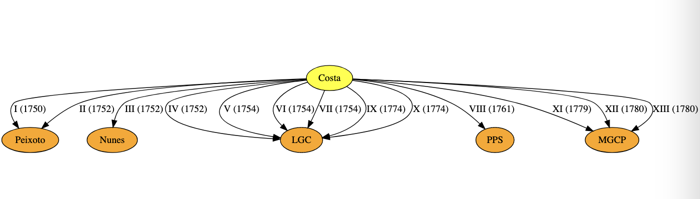
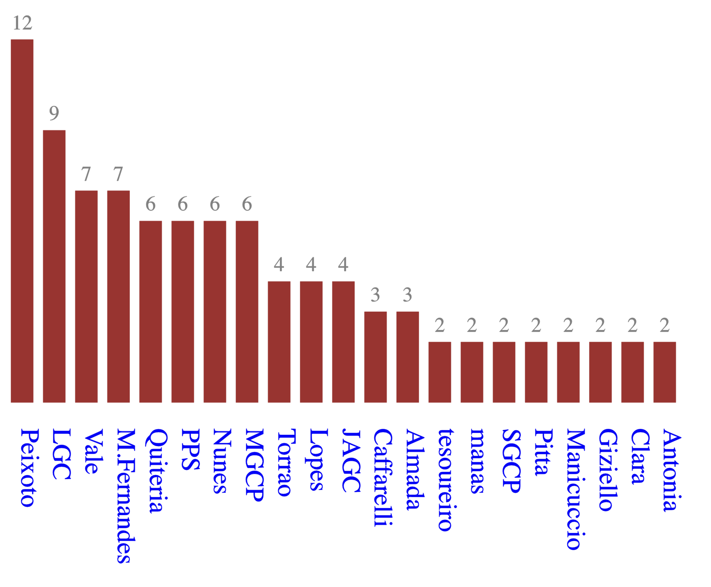
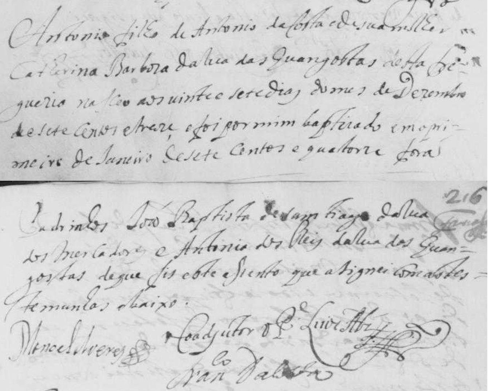

# Who were the friends of Abbé António da Costa in Porto?
<!-- _backgroundColor: "#CCE5FF" -->

JN Oliveira

May 25th, 2024

**[Symposium Abbé António da Costa, CEHUM](https://www.uminho.pt/PT/siga-a-uminho/Paginas/Detalhe-do-evento.aspx?Codigo=61278)**, UMinho, Braga

---

# *L'Abate Portoghese*
<!-- _backgroundColor: "lightcyan" -->

- *L'Abate* **António da Costa** (1714-1780?) was a Portuguese musician who, born in the city of **Porto**, left the country in 1749/50 for **Rome**.

- Later travelling to **Venice** and **Paris**, he eventually settled in **Vienna**, where he is thought to have died around 1780.

- Misanthrope, he despised the positions offered to him, living most of his life in poverty.

- His intelligence and idiosyncratic behaviour attracted the attention of the high nobility, in whose salons he sometimes played his compositions for violin or guitar.

---

# First news (1750)
<!-- _backgroundColor: "lightcyan" -->

> "*Pedi um passaporte em Santiago e não mo deram (...) e duas vezes estive preso (...) não posso dizer n'uma carta o que passei em quatro mezes e tanto de vida de novellas (...)*"

(Letter I, 1750, sent to friend João Peixoto)

---

# First news (1750)
<!-- _backgroundColor: "lightcyan" -->

He may have escaped because he had confronted someone very powerful who could arrest him.

### But...

* ... why? how?

* ... who *was* **António da Costa** ?

---

# Popular aphorism

<!-- _backgroundColor: "lightcyan" -->

<h3>
&quot;<em>Diz-me com quem andas e dir-te-ei quem és</em>&quot;
 
 

(&quot;<em>Tell me who you hang out with and I'll tell you who you are</em>&quot;)

</h3>
 
 

### :arrow_forward: Research question:

> Who did hang out with **António da Costa** before he left Porto?

---

# Sources
<!-- _backgroundColor: "lightcyan" -->

### 13 Letters sent to Porto (1750-1780)
- Manuscript copy: ANTT [COD. 4296](http://id.bnportugal.gov.pt/bib/catbnp/2137427) (old keys: P-2-18, O-2-18)
* Studied and published by **J. Vasconcelos** (1879)
* Commented in depth by **Teófilo Braga** ([1879](https://purl.pt/63))
* Also commented by **Ann Livermore** ([1945](https://www.jstor.org/stable/727650))
* Re-published by **Lopes Graça** (1946)

<!--
The Abade Antonio da Costa
Author(s): Ann Livermore
Source: Music & Letters, Jul., 1945, Vol. 26, No. 3 (Jul., 1945), pp. 162-171
Published by: Oxford University Press
Stable URL: https://www.jstor.org/stable/727650
!-->

---
# Other sources
<!-- _backgroundColor: "lightcyan" -->

- **Charles Burney** [travel diary](https://books.google.pt/books?id=a0lptAEACAAJ&printsec=frontcover&hl=pt-PT&source=gbs_ge_summary_r&cad=0#v=onepage&q=259&f=false) (1772)

- 5 Letters exchanged between **Martini** and **Tartini** and **Costa** (1766-1780)

- Manuscript scores preserved in the archives of **Vienna**, **Berlin** and **Bologna**.

---

# 13 Letters to Porto (1750-1780)

<!-- _backgroundColor: "lightcyan" -->

---

# 13 Letters to Porto (1750-1780)
<!-- _backgroundColor: "lightcyan" -->

### **5** recipients
### **100+** people mentioned

### Altogether a complete maze...

> ### Where to start from?

---

# 13 Letters to Porto (1750-1780)

<!-- _backgroundColor: "lightcyan" -->

### In the diagrams, let

> $a \rightarrow b$

### mean:

> A. da Costa mentioned $b$ in a letter to $a$

### That is,

> $a$ knew (or got to know about) $b$.

### :arrow_forward: First question - did these **5** recipients know each other?

---

# The 13 Letters to Porto (1750-1780)

<!-- _backgroundColor: "lightcyan" -->

### **5** recipients
### **21** individuals mentioned in **more than one** letter.

> Roughly, two **clusters** = **music**-related + others.

---
<!-- _backgroundColor: "lightcyan" -->

### Histogram

---
<!-- _backgroundColor: "lightcyan" -->

### Time spans

---

# The 13 Letters (1750-1780)
<!-- _backgroundColor: "lightcyan" -->

To start unravelling the "puzzle", let us record the **recipients** whose names are given in full:

-   **Manuel Gomes Costa Pacheco** (MGCP) - letters XI-XIII

-   **Pedro Pereira de S.Paio** (PPS) - letter VIII

-   **Luís Costa Gomes** (LCG) - letters IV-VII, IX and X.

### Let us search for them in archival sources.

---

# Manuel Gomes Costa Pacheco
<!-- _backgroundColor: "lightcyan" -->

**1768** - Process of qualification for **Military Order of Christ** Knighthood.

> "*Diligência de habilitação para a Ordem de Cristo*" of **Manuel Gomes Costa Pacheco**, born in Porto in 1733 and living in **Vila da Feira**.

(ANTT [7637352](https://digitarq.arquivos.pt/ViewerForm.aspx?id=7637352) :arrow_forward: 3)

This document mentions his parents **Luís Gomes Costa** and **Clara Luísa Pacheco** living in the **Ferraria de Cima** Street, Parish of **Vitória**, Porto.

---

# Luís Gomes Costa
<!-- _backgroundColor: "lightcyan" -->

### **Luís Gomes Costa**, father of **Manuel**, is referred to as

> a renowned jurisconsult, lawyer of the **Relação** (Royal Court of Appeal) and often **Juíz dos Órfãos** (= orphans protector in patrimonial inheritance cases).

---

# Luís Gomes Costa
<!-- _backgroundColor: "lightcyan" -->

### Cross-checking with the Student Registry of the **University of Coimbra**:

> **1730**: **Luís Gomes Costa**, son of José Gomes Costa (Porto), enrolled as Law student on **1730-10-01** and graduated on **1735-07-03**.

(Source: AUC [202836](https://pesquisa.auc.uc.pt/details?id=202836))

---

# The "Snr. Doutor"
<!-- _backgroundColor: "lightcyan" -->

Cross-checking:

> **Luís Gomes Costa** is recipient of 6 letters, between 1752 and 1774.

In his letters, **António da Costa** refers to him as

> the "**Snr. Doutor**"

and

> his best friend ever ("*o melhor amigo que tive*").

---

# Parish of Vitória (S. Bento)
<!-- _backgroundColor: "lightcyan" -->

**1758** - According to the information provided in

- **Memórias Paroquiais**

the **Parish of Vitória** is considered

>  illustrious and made up of the most noble and enlightened people in the city.

(ANTT [4241286](https://digitarq.arquivos.pt/viewer?id=4241286) :arrow_forward: 56, item 18)

---

# Ferraria de Cima street
<!-- _backgroundColor: "lightcyan" -->
<!--  -->

**Rua da Ferraria de Cima** (Upper Ferraria street) is today's

>  **Rua dos Caldeireiros**.

**UNESCO** World Heritage:

> As of 1996, **Vitória** is one of the four districts within the **UNESCO World Heritage** Classified Zone of **Porto**.

---

# The Gomes Costa family nucleus

<!-- _backgroundColor: "lightcyan" -->

**Below:** data collected from the **birth** **records** of parishes **Vitória** and **Sé** ([ADP](https://pesquisa.adporto.arquivos.pt/)):

| When | Who | Where | Description | Reference |
|------|-----|-------|-------------|----------|
| 1732-08-13 | **Luís Gomes Costa** and **Clara Luísa Pacheco** | Sé | Marriage | [490960](https://pesquisa.adporto.arquivos.pt/ViewerForm.aspx?id=490960) :arrow_forward: 294 |
| 1733-04-04 | **Manuel** | Sé | Birth of 1st son | [490868](https://pesquisa.adporto.arquivos.pt/ViewerForm.aspx?id=490868) :arrow_forward: 825 |
| 1735-03-01 | José | Vitória | Birth of 2nd son | [491136](https://pesquisa.adporto.arquivos.pt/ViewerForm.aspx?id=491136) :arrow_forward: 263 |

---

# The Gomes Costa family nucleus

<!-- _backgroundColor: "lightcyan" -->

Data collected from the **birth** **records** of parishes **Vitória** and **Sé**:

| When | Who | Where | Description | Reference |
|------|-----|-------|-------------|-----------|
| 1737-06-09 | **Antónia** | Vitória | Birth of 1st daughter | [491136](https://pesquisa.adporto.arquivos.pt/ViewerForm.aspx?id=491136) :arrow_forward: 293 |
| 1740-01-12 | **Sebastião** | Vitória | Birth of 3rd son | [491136](https://pesquisa.adporto.arquivos.pt/ViewerForm.aspx?id=491136) :arrow_forward: 326
| 1742-06-10 | Luís | Vitória | Birth of 4th son | [491136](https://pesquisa.adporto.arquivos.pt/ViewerForm.aspx?id=491136) :arrow_forward: 357 |
| 1744-10-10 | Antónia (?) | Vitória | Birth of 2nd daughter | [491136](https://pesquisa.adporto.arquivos.pt/ViewerForm.aspx?id=491136) :arrow_forward: 392 |
| 1746-01-22 | Luísa       | Vitória | Birth of 3rd daughter | [491136](https://pesquisa.adporto.arquivos.pt/ViewerForm.aspx?id=491136) :arrow_forward: 412 |

---

# The Gomes Costa family nucleus

<!-- _backgroundColor: "lightcyan" -->

In particular:

| When | Who | Where | Description | Reference |
|------|-----|-------|-------------|-----------|
| 1742-06-10 | Luís | Vitória | "(...) *godparents Father **José Alberto Gomes Costa** and **Quitéria Maria**, nun at [**Monchique**](https://pesquisa.adporto.arquivos.pt/details?id=510039), by her attorney (...) **António da Costa**, all from Ferraria de Cima*" | [491136](https://pesquisa.adporto.arquivos.pt/ViewerForm.aspx?id=491136) :arrow_forward: 357 |

---

# The Gomes Costa family nucleus

<!-- _backgroundColor: "lightcyan" -->

Cross-checking:

- **José Alberto Gomes Costa** - a priest, he is oncle of the baptized and mentioned in letters IX-XI and XIII.

Possibilities:

> **António da Costa** - quite likely "*our man*"...

> **Quitéria Maria** - the "*snr.ª Quitéria*" referred to in 6 letters?

---

# The Gomes Costa family nucleus

<!-- _backgroundColor: "lightcyan" -->

| When | Who | Where | Description | Reference |
|------|-----|-------|-------------|-----------|
| 1774-10-08 | Dr. Luís Gomes Costa $\dagger$ | Vitória | Dies aged *circa* 70, his son **Sebastião Gomes Costa** being the executor of the will ("*testamenteiro*") | [491251](https://pesquisa.adporto.arquivos.pt/viewer?id=491251) :arrow_forward: 109 |

### Notes:

- Letter X (Vienna, 1774-12-24) written unaware of the **death** of its recipient.
- Son **Sebastião Gomes Costa** is mentioned in letters XI, XII sent to his brother **Manuel**.

---

# The Gomes Costa family nucleus

<!-- _backgroundColor: "lightcyan" -->

| When       | Who | Where | Description | Reference |
|------------|-----|-------|-------------|-----------|
| 1775-11-23 | D. Clara Luísa Pacheco $\dagger$ | Vitória | Dies aged *circa* 70 "(...) *por lhe dar um acidente de apoplexia*" |  [491251](https://pesquisa.adporto.arquivos.pt/viewer?id=491251)  :arrow_forward: 113 |

### Notes

Both deaths are the subject of letter XI (1779-12-04) sent to son **Manuel**:

> "(...) *notícias* (...) *ensanguadas com a morte do Sr. seu Pai* (...) *mas senti muito as outras que V. M. me conta da Sra. sua mãi* (...)"

Note the 4 year gap - but **A. da Costa** knew about **Luís Costa**'s death one year before.

---

# The Gomes Costa family network
<!-- _backgroundColor: "lightcyan" -->

<!-- More from the parish records: -->

| When | Who | Where | Description | Reference |
|------|-----|-------|-------------|----------|
| 1732-08-13 | **Luís** & **Clara** | Sé | Schoolmaster Rev. **Manuel Carneiro de Araújo** is witness of marriage | [490960](https://pesquisa.adporto.arquivos.pt/ViewerForm.aspx?id=490960) :arrow_forward: 294 |
| 1735-03-01 | José  | Vitória | Birth: godmother Antónia Rosa Félix, a nun in [**Monchique**](https://pesquisa.adporto.arquivos.pt/details?id=510039), her attorney being Rev. **Manuel Carneiro de Araújo** | [491136](https://pesquisa.adporto.arquivos.pt/ViewerForm.aspx?id=491136)  :arrow_forward: 263 |

School-master **Manuel Carneiro de Araújo** ($\dagger$ 1755) is mentioned in letter VI (1754):

> "(...) *aqui me disse o snr. Lopes, que o snr. mestre-escola da Sé tivera um estupor grande*"

---

# The Gomes Costa family network
<!-- _backgroundColor: "lightcyan" -->

Rev. **Manuel Carneiro de Araújo**, schoolmaster of Porto Cathedral

| When | Who | Where | Description | Reference |
|------|-----|-------|-------------|----------|
| 1717-01-16 | **Manuel Carneiro de Araújo** | Porto cathedral | As schoolmaster and secretary of the Chapter ("*Cabido*") of the Cathedral, he signs a document related to works in the cloister of the Cathedral | ([JJB Ferreira-Alves, 2001](https://periodicos.ufba.br/index.php/rcvisual/article/download/53713/28762)) |

---

# The Gomes Costa family network
<!-- _backgroundColor: "lightcyan" -->

Rev. **Manuel Carneiro de Araújo**, schoolmaster of Porto Cathedral

| When | Who | Where | Description | Reference |
|------|-----|-------|-------------|----------|
| 1728/29 | Rev. Manuel Carneiro de Araújo, schoolmaster | Porto | Provider of Porto's Holy House of Mercy (*S.Casa da Misericórdia do Porto*) | UP  [32942](https://sigarra.up.pt/fep/pt/pub_geral.show_file?pi_doc_id=32942 ) |
| 1744-04-26 | Leonor Caetana | Miragaia | daughter of the schoolmaster takes her habit at the convent of [**Monchique**](https://pesquisa.adporto.arquivos.pt/details?id=510039) | ANTT [4638421](https://digitarq.arquivos.pt/ViewerForm.aspx?id=4638421) :arrow_forward: 23 |

<!-- ; **1732-08-13**: assiste ao casamento de Luís Gomes da Costa com Clara Luísa Pacheco na freguesia da Sé (tiff=294 de [casamentos](https://pesquisa.adporto.arquivos.pt/ViewerForm.aspx?id=490960)); **1735-03-01**: procurador da madrinha de José, filho do Lic. Luís Gomes Costa etc ([tiff=263](https://pesquisa.adporto.arquivos.pt/ViewerForm.aspx?id=491136)); 

 **1754**: \"…*Aqui me disse o snr. Lopes, que o snr. mestre-escola da Sé tivera um estupor grande* … \" ; **1755-12-30**: morre o Rev. Manuel Carneiro de Araújo, mestre escola da Sé, morador na Rua Chã ([tiff=859](https://pesquisa.adporto.arquivos.pt/ViewerForm.aspx?id=491036)). Deixou como testamenteira a Santa Casa da Misericórdia do Porto.
-->

---

# The Gomes Costa family network
<!-- _backgroundColor: "lightcyan" -->

More from the parish records:

| When       | Who | Where | Description | Reference |
|------------|-----|-------|-------------|-----------|
| 1746-01-22 | Luísa       | Vitória | Birth: godfather **D. Frei José Maria da Fonseca e Évora**, Bishop of Porto  | [491136](https://pesquisa.adporto.arquivos.pt/ViewerForm.aspx?id=491136) :arrow_forward: 412 |

[**José Maria da Fonseca "Évora"**](https://en.wikipedia.org/wiki/José_Maria_da_Fonseca_e_Évora) (1690-1752) bishop of Porto since 1743.

He is the "**bispo Évora**" mentioned in letter X (1774):

>  "(...) *lembra-me o bispo Évora, que a mim já aí se me afigura que nunca se estuporaria, se se deixasse estar em Roma*"

---
# The Gomes Costa family network
<!-- _backgroundColor: "lightcyan" -->

[José Maria da Fonseca "Évora"](https://en.wikipedia.org/wiki/José_Maria_da_Fonseca_e_Évora) (1690-1752):

* Left for **Rome** in 1712, as part of the embassy of the [Marquis of Fontes](https://en.wikipedia.org/wiki/Rodrigo_Anes_de_S%C3%A1_Almeida_e_Meneses,_1st_Marquis_of_Abrantes)

* In 1740 he founded a large library in the AraCoeli convent (the [Biblioteca Eborense](https://www.internetculturale.it/it/41/collezioni-digitali/26298/catalogo-della-biblioteca-del-convento-di-santa-maria-in-aracoeli-di-roma))

* He served as Portugal's ambassador in **Rome** (1728 $\rightarrow$) until accepting the bishopry of **Porto** (1741).

* He died in **Porto** in 1752 when Costa was already in **Rome**.

---

# The Costa Pacheco family (Vila da Feira)
<!-- _backgroundColor: "lightcyan" -->
More about **Manuel Gomes da Costa Pacheco**:

| When       | Who       | Where  | Description | Reference |
|------------|-----------|--------|-------------|-----------|
| 1768-07-20 | Margarida | Arouca | Birth of a daughter of Luísa (single) the father being ("*deu por pai*") captain **Manuel Gomes da Costa Pacheco**, notary owner of Vila da Feira ("*escrivão proprietário*") | [1183231](http://digitarq.adavr.arquivos.pt/ViewerForm.aspx?id=1183231) :arrow_forward: 0104 |

---
# The Costa Pacheco family (Vila da Feira)
<!-- _backgroundColor: "lightcyan" -->

Cross-checking:

| When       | Who       | Where  | Description | Reference |
|------------|-----------|--------|-------------|-----------|
| 1764-06-16 | Manuel G.C. Pacheco | Vila da Feira | Notary owner (tabelião) | ANTT [1445904](http://digitarq.adavr.arquivos.pt/ViewerForm.aspx?id=1445904) |
| 1783-10-08 | Manuel G.C. Pacheco | Coimbra | Enrolls  in law, maths and philosophy until 1787 | AUC [220452](https://pesquisa.auc.uc.pt/details?id=220452) |

Last reference as notary public in 1805 (ANTT [1445904](https://digitarq.adavr.arquivos.pt/details?id=1445904))

<!--- > 1764-06-17: first reference ([PT/ADAVR/NOT/CNCRM/001/0024](https://adavr.dglab.gov.pt/wp-content/uploads/sites/5/2018/12/Inventário-PT-ADAVR-NOT-CNCRM.pdf) + [keep](https://digitarq.adavr.arquivos.pt/details?id=1445904)) to notary Manuel Gomes da Costa Pacheco.  -->

> Studies in **Coimbra** after exchange of letters with Costa.

---

# The Costa Pacheco family (Vila da Feira)
<!-- _backgroundColor: "lightcyan" -->

**Sebastião**, **Manuel**'s younger brother, also followed a Law career:

| When       | Who       | Where  | Description | Reference |
|------------|-----------|--------|-------------|-----------|
| 1758-10-01 | Sebastião Gomes Costa Pacheco | Univ. Coimbra | Enrolled as Law student until 1761 | AUC [220680](https://pesquisa.auc.uc.pt/details?id=220680&detailsType=Description&ht=sebastião%7cgomes%7ccosta%7cpacheco) |
| 1818-12-27 | Dr. Sebastião Gomes Costa Pacheco $\dagger$ | Vila da Feira | Death | [1255475](https://digitarq.adavr.arquivos.pt/ViewerForm.aspx?id=1255475) :arrow_forward: 421 |

---
# The Costa Pacheco family (Vila da Feira)
<!-- _backgroundColor: "lightcyan" -->

More about the **Costa Pacheco**'s descendents in:

> [Freguesia de S. Nicolau da Vila da Feira](http://ww3.aeje.pt/avcultur/avcultur/Aveidistrito/Boletim16/Page58.htm) by Roberto Vaz de Oliveira, in Aveiro e o seu Distrito, N.º 16, Junta Distrital de Aveiro, December 1973

Available :arrow_forward: [on-line](http://ww3.aeje.pt/avcultur/avcultur/Aveidistrito/Boletim16/Page58.htm). Aside, from the same source:
>  Picture of **Sebastião Gomes Costa Pacheco** while a Law student at Coimbra.

---
<!-- _backgroundColor: "lightcyan" -->
# Pedro Pereira de S.Paio (1694-1776)

| When | Who | Where | Description | Reference |
|------|-----|-------|-------------|----------|
| 1776-11-03 | Rev. **Pedro Pereira de S.Paio** $\dagger$ | Sé | Death at S. António do Penedo. Executor of his will: his nephew **Carlos Vieira de Melo**, nobleman of the Royal House ("*fidalgo da Casa Real*"). |  [491038](https://pesquisa.adporto.arquivos.pt/ViewerForm.aspx?id=491038) ▶️ 1043 |

Letters:

- **Pedro Pereira** - recipient of the sole letter sent from **Venice** (letter VIII, 1761-7-22).

- His death was received with much regret in letter XI (**1779-12-04**).

---

# Pedro Pereira de S.Paio (1694-1776)

<!-- _backgroundColor: "lightcyan" -->

| When | Who | Where | Description | Reference |
|------|-----|-------|-------------|----------|
| 1694-04-25 | **Pedro** (birth) | S. Nicolau (Porto) | Son of cap. **António Pereira de S.Paio** and **D. Mariana Francisca de França**, Lady of the Queen's Chamber  | [490629](https://pesquisa.adporto.arquivos.pt/ViewerForm.aspx?id=490629) :arrow_forward: 30 |
| 1710-10-14 |  **Pedro Pereira de S.Paio** | Porto | Application to the S.Tiago Order (then a 15y old student) | ANTT [7671882](https://digitarq.arquivos.pt/details?id=7671882) |

One of the witnesses is **Martinho Coelho**, luthier living in the parish of Sé ([7671882](https://digitarq.arquivos.pt/details?id=7671882) :arrow_forward: 23)

---
# Pedro Pereira de S.Paio (1694-1776)

<!-- _backgroundColor: "lightcyan" -->

About his father **António Pereira de Sampaio**:

<!--
1689-1691: ver a sua Habilitação a familiar do St.Ofício (1689-1691, detalhes a partir de [tiff=29](https://digitarq.arquivos.pt/details?id=2322187)), onde aparece cavaleiro da Ordem de Cristo por, *estando ausente nas partes do Norte*, ter acompanhado a rainha a Portugal (ANTT [2322187](https://digitarq.arquivos.pt/details?id=2322187) ▶️ 33);
-->

1690: "(...) He went from Hamburg, where he resided, to the Court of Heidelberg to offer himself to the [Marquis of Alegrete](https://pt.wikipedia.org/wiki/Marqu%C3%AAs_de_Alegrete) as ambassador there to accompany the [Queen](https://en.wikipedia.org/wiki/Maria_Sophia_of_Neuburg) to this kingdom"

> "*(...) passou de Hamburgo onde residia à Corte de Heidelberg oferecer-se ao Marquês do Alegrete embaixador nela para acompanhar a este reino a Rainha*".

(ANTT [1860259](https://digitarq.arquivos.pt/details?id=1860259) ▶️ 427)

---

# João Alves do Vale

<!-- _backgroundColor: "lightcyan" -->

| When | Who | Where | Description | Reference |
|------|-----|-------|-------------|-----------|
| 1744-10-10 | Antónia | Vitória | Rev. **João Alves do Vale** signature in the birth record of Luís Gomes Costa's 2nd daughter | [491136](https://pesquisa.adporto.arquivos.pt/ViewerForm.aspx?id=491136) :arrow_forward: 392 |

Letters 

- Costa sends regards several times to him, referred to as *the renowned Alves do Vale*

> ("*o insigne Alves do Vale*").

---

# João Alves do Vale

<!-- _backgroundColor: "lightcyan" -->

| When | Who | Where | Description | Reference |
|----------|-----|-------|-------------|-----------|
|1756-10-02| Rev. João Alves do Vale | Vitória | godfather | [491139](https://pesquisa.adporto.arquivos.pt/ViewerForm.aspx?id=491139) ▶️  594 |
|1758-07-30| Rev. João Alves do Vale | Vitória | Living in  Ferraria de Cima, baptizes a child of the same street | [491139](https://pesquisa.adporto.arquivos.pt/viewer?id=491139) :arrow_forward: 627 |
|1759-07-23| Rev. João Alves do Vale | Vitória | The same | [491139](https://pesquisa.adporto.arquivos.pt/viewer?id=49113)  ▶️  643 |

:arrow_forward: About his family in [Rua das Flores](https://cabrais.pt/sites/zAscen/Vales%20Pereiras%20Cabrais.pdf).

---

# "Snr. Torrão"
<!-- _backgroundColor: "lightcyan" -->

Rev. Dr. **António Alvo Torrão** is mentioned in letters VIII (1761), X (1774) and XII (1780).

In particular, letter X (1774):

- [ (...) "*and please do so via Mr. Peixoto to Mr. Torrão, of whom V.M. will explain the* **elusive word** *said to me about* **him being like he was before**" ]

> "(...) "*e mos faça fazer pelo senhor Peixoto ao senhor Torrão, de quem V.M. explicará a palavrinha equívoca, que me disse dele de estar como dantes*"

Who was "senhor **Torrão**"?

---

# The Alvo Torrão family
<!-- _backgroundColor: "lightcyan" -->

| When | Who | Where | Description | Reference |
|----------------|---------|------------|-------------|-----------|
| **1715-02-03** | António | S. Nicolau | Birth, son of **António Lopes Torrão**, [Knight of Ordem de Cristo](https://digitarq.arquivos.pt/details?id=7675300) and his wife **D. Maria Alvo Pereira** | [490632](https://pesquisa.adporto.arquivos.pt/ViewerForm.aspx?id=490632) ➡️  37 |
| **1730-10-01** | António Alvo Torrão (Rev.) | Univ. Coimbra | Enrolls as Law student (will get his degree by 1736)  | AUC [203741](https://pesquisa.auc.uc.pt/details?id=203741) |

---

# The Alvo Torrão family
<!-- _backgroundColor: "lightcyan" -->

| When | Who     | Where | Description | Reference |
|----------------|---------|------------|-------------|-----------|
| **1739-03-11** | Francisca Inácia + Maria Marcelina | Monchique, Miragaia | "*tomam hábito em [Monchique](https://pesquisa.adporto.arquivos.pt/details?id=510039) a pupilas D. Francisca Inácia e D. Maria Marcelina, filhas de António Lopes Torrão e sua mulher D. Maria Alvaro* (sic)" | ANTT [4638421](https://digitarq.arquivos.pt/viewer?id=4638421) :arrow_forward: 17 |
| **1740-09-08** | António Alvo Torrão | Coimbra | Application to Inquisition collaborator ("*Habilitação a familiar do Santo Ofício*") | ANTT [2344229](https://digitarq.arquivos.pt/details?id=2344229) |

---

# "Snr. Torrão"
<!-- _backgroundColor: "lightcyan" -->

However, the process was not completed, given this **negative information** in the minutes:

> "*I'm not surprised that António Alvo Torrão doesn't declare himself a priest, because in truth he doesn't seem like it either in his customs or in his habits. (...)*"

> "*He received the extermination sentence for flirting with nuns; and in the land where he was he did such things that he was expelled from the same land again.*"

>  "**He has a reputation for bad behaviour;** *and until he reforms his ways and changes the* **scandal of his life** *as an example, it seems to me that he is not capable of what he desires.*"

Porto, 28th February 1739. Manuel dos Reis Bernardes (ANTT [2344229](https://digitarq.arquivos.pt/details?id=2344229))

---
<!-- _backgroundColor: "lightcyan" -->

> "(...) *Não me admiro que o pretendente António Alvo Torrão se não declare por padre, porque com efeito o não parece nem nos costumes, nem nos hábitos. Eu o conheço muito bem, porque é meu  convizinho na mesma freguesia, posto que em diferentes ruas. É natural desta freguesia de São Nicolau, e filho legítimo dos pais que declara. Foi estudante; tomou ordens menores; e depois embaraçando-se com uma moça, por não casar com ela, tomou ordens sacras per saltum; pelo que foi punido, teve degredo, que poderá ter satisfeito; porém ainda está suspenso do exercício das suas ordens. Teve a pena de extermínio por feirático; e na terra onde esteve fez tais coisas, que teve ordem para novo extermínio da mesma terra.* **Tem a reputação de mal procedido; e enquanto se não reformar em costumes, e trocar em exemplo o escândalo da sua vida, me parece não está capaz do que pretende**, *e o mesmo há-de parecer a todos os que o conhecem. (…) Porto, 28 de Fevereiro de 1739. Manuel dos Reis Bernardes*"

---
# About 18c Porto

<!-- _backgroundColor: "lightcyan" -->

### COSTA, Agostinho Rebelo da ($\dagger$ 1791)
> *Descripção topografica, e historica da Cidade do Porto. Que contém a sua origem, situaçaõ, e antiguidades: a magnificencia dos seus templos, mosteiros, hospitaes, ruas, praças, edificios, e fontes... / feita por Agostinho Rebello da Costa*

Porto: na Officina de Antonio Alvarez Ribeiro, 1789. - XXXII, 374, [6] p.

(BND [22517](https://purl.pt/22517))

---

# Music academies (18c Porto)

<!-- _backgroundColor: "lightcyan" -->

### Rebelo da Costa:  <!-- pdf 106 -->

"*In the summer, in the comfort of the farms that surround the city, on the banks of the Douro, the refined society of the families that meet there, the beautiful* **music concerts** (...)"

> "*No verão a amenidade das Quintas, que rodeão a Cidade, e bordão as margens do Rio Douro, a bela sociedade com que as familias ali se comunicam, os bons* **concertos de música** (...)"

([22517](https://purl.pt/22517) :arrow_forward: 106, fol. 54)

<a href="https://www.visitberlin.de/en/event/divertimento-musical-pleasure-court">Image &copy; visitberlin.de</a>

---

# Letter VI (Rome, 1754)

<!-- _backgroundColor: "lightcyan" -->

> "*Diga-me também como lhe vai Sr. João; se lhe sopram agora mais que o ano passado esses bailes, e essas* **fúrias de Rio**, *que as funções de Martinho Velho bem sei eu que estão acabadas*"

Ann Livermore:

> *(...) Then he asks for news of Joao. Is he taken now than last year with those dances and those furias from Rio?...*"

---

# "Fúrias de Rio" (18c Porto)

<!-- _backgroundColor: "lightcyan" -->

### Rebelo da Costa:

"*(...) and also the so-called **Fúrias de Rio** (...) That's what they call the fun they have, sailing sweetly to the sound of **harmonious** **instruments** on the Douro River in awning boats, which gracefully illuminate at night.*"

> *(...) e ainda as chamadas* **Fúrias de Rio** *(...) Assim denominam os divertimentos com que se entretém, navegando docemente ao som d'**armonicos instrumentos** sobre o Rio Douro com barcos toldados, que de noite iluminam graciosamente*.

([22517](https://purl.pt/22517) :arrow_forward: 106, fol. 54)

<!-- >  *O ardor da estação, que faz insensível o curso do Rio, dá liberdade a que dentro dos mesmos barcos se merende, ceie, e jogue sem temor de algum perigo*. -->

---

# About 18c Porto

<!-- _backgroundColor: "lightcyan" -->

### Still Rebelo da Costa:

> "*Women (...) have (in general) good presence, grace and elegant appearance; witty in conversation and lively in what they undertake, and in (...) the various tasks to which they dedicate themselves.*"

>  "*Many know **music** perfectly and **play** various harmonic **instruments** skillfully*".

(BN [22517](https://purl.pt/22517) :arrow_forward: 104, fols.52-53)

<!-- (...) Elas (falando geralmente) são de boa presença, garbo e talhe airoso ; espiritosas na conversação e animadas no que emprendem, e executão (...) e prendadas nos differentes lavores a que se applicam. Muitas sabem perfeitamente música e tocam com destreza vários instrumentos harmónicos. -->

---

# Letter VII (Rome, 1754)
<!-- _backgroundColor: "lightcyan" -->

- "*I have often offered to send you and Mrs. **Quitéria** some songs she ordered from me, but I almost regret it, because I haven't heard anything that could satisfy her, in my opinion (...)*"

> "*Muitas vezes me tenho oferecido a V. M. e à Sr.ª **Quitéria** para lhe mandar alguma música que ela me encomendasse, mas quase que estou de todo arrependido, porque não ouço coisa que lhe possa contentar, a meu parecer* (...)"

 
<a href="https://www.youtube.com/watch?v=efonp34pV2E">Image &copy; BBC</a>

---
# Letter VII (Rome, 1754)
<!-- _backgroundColor: "lightcyan" -->

- "*However, if Mrs. **Quitéria** wants to try her luck, I will send her a piece, and as she finds it she will make it; but could she say what it should be and under what circumstances.*"

> "*Todavia se a Sr.a **Quitéria** quiser experimentar alguma coisa à fortuna, mandar-lhe-ei uma peça, e assim como se achar com ela, assim fará; mas há-de ela dizer que coisa há-de ser, e com que circunstâncias.*"

 
<a href="https://www.youtube.com/watch?v=efonp34pV2E">Image &copy; BBC</a>

---
<!-- _backgroundColor: "lightcyan" -->

# Sr.ª Quitéria

Teófilo Braga ([1879](https://purl.pt/63)):

> "*The Doctor's wife, Dona Quitéria, was also passionate about music, and Costa had sent her some compositions from Rome.*"

However, we have found out that

> the wife of Dr. **Luís Gomes Costa** was Mrs. **Clara Luísa**, not Mrs. Quitéria.

So, who was Mrs. Quitéria?

<!-- ("*A mulher do Doutor, Dona Quitéria, também era apaixonada por música, o de Roma lhe enviara Costa algumas composições*") -->

---
<!-- _backgroundColor: "lightcyan" -->

# Sr.ª Quitéria

Referred to in 6 letters, different contexts

| When | Letter | Who | Context     |
|------|-----|-------|-------------|
| 1752 | IV | Luís G. Costa | Quitéria + João |
| 1754 | V | Luís G. Costa | Quitéria + João ; Quitéria + etc |
| 1754 | VI | Luís G. Costa | Quitéria + "other *senhoras*" |
| 1754 | VII | Luís G. Costa | Quitéria + "other *doutoras*" |
| 1774 | IX | Luís G. Costa | Quitéria + Antónia + Margarida |
| 1779 | XI | Manuel C. Pacheco | Quitéria $\dagger$ | 

---
<!-- _backgroundColor: "lightcyan" -->

# Sr.ª Quitéria

| When | Letter | Receipient | Context     |
|------|-----|-------|-------------|
| 1774 | IX | Luís G. Costa |  “I am very happy that Mrs. **Quitéria**, Mrs. **Antónia** and Mrs. **Margarida**, (...) are doing well, and please tell that I miss them. Who would ever have thought that there would be these **permits to be away from the convent** for so many years?” |

> "(...) *Tenho grande gosto que a Sr.a Quitéria, a Sr.a Antónia e a S.a Margarida, espero eu (...) passem bem, e lhe peço que lhe dê saudades minhas. Quem diria algum dia que havia de haver estas licenças de estar fora do convento tantos anos?*"

---

# Sr.ª Quitéria
<!-- _backgroundColor: "lightcyan" -->

### ➡️  Mrs. Quitéria *and the others* - nuns at Monchique?

Quitéria was a common name in the 18c. For instance:

> 1732-05-29: (Some) **Maria Quitéria** joins the Monchique convent

From the Monchique's **Book of Entries into the Convent and Professions**, 1730-1832 (ANTT [4638421](https://digitarq.arquivos.pt/details?id=4638421) ➡️  68)

Further research needed.

---

# Women in António da Costa's letters
<!-- _backgroundColor: "lightcyan" -->

Letter VI to Luís G. Costa (Rome, 1754):

> "*(...) I miss **Mrs. Quitéria** endlessly, and I ask you to tell her to receive my wish and the good will that I would have to pay her a visit from time to time, to enjoy her speech and her so funny laugh and very pleasant way, which even now seems much better imagined from here*"

<!-- Dê-me infindas saudades à Sr.a Quitéria, e lhe dirá que me receba o desejo e a boa vontade tivera de lhe ir fazer uma visita de quando em quando, para gozar da sua fala e do seu riso tão engraçado, e do seu modo tão agradável, que ainda agora me parece muito melhor imaginando nele cá, -->

> "*(...) those who do not have a beard, even if they are tall, and who speak thinly; these 'doutoras', yes, they never leave my mind*"

<!-- (...) aquelas que não têm barba, ainda que sejam grandes, e que falam delgadinho; estas doutoras sim, que nunca me saem da cabeça -->

Letter VII to Luís G. Costa (Rome, 1754):

> "*(...) she [**Mrs. Quitéria**] and the other 'doutoras' I knew make me even more bitter about being so far from Portugal*"

<!-- "(...) ela [sra. Quitéria] e outras doutoras, que eu conhecia, me fazem ser mais amargoso estar tão longe de Portugal" -->

---

# Rome, 1752
<!-- _backgroundColor: "lightcyan" -->

**Trios** sent to Porto:

>  “*(…) here are two [trios] to join the others and make half a dozen*” <!-- (“*ahi vão dous para ajustar com os outros a meia duzia*”). -->

>  “*(...) the others already there are more tender; these are best for when a person's heart is unburdened by **love**, but they still comfort the chest.*" <!-- ("*os outros que lá estão são mais enternecidos; estes são melhores para quando uma pessoa tem o coração mais aliviado de amores, mas nem por isso deixam de confortar o peito*") -->

(Letter II, 28 Feb. 1752)

---

# The escape from Porto
<!-- _backgroundColor: "lightcyan" -->

Teófilo Braga ([1879](https://purl.pt/63)):

* "(...) If any attempt had been made to persecute him as a **free thinker**, it would have been impossible for him to obtain the letter from the bishopric of Porto that enabled him to receive in Rome the holy orders and become a cleric at mass."

* "(...) For us the reason is different; it is enough to describe his impressionistic character, the artistic environment in which he lived and, finally, the conditions of his youth, to look for the reason for his sudden departure from Portugal: a **romantic intrigue**."

<!--
(...) para explicar a sua fuga do Porto (...) Se lhe Houvessem tentado qualquer começo do perseguição como livre pensador, ter-lhe-ia sido impossível obter as cartas demissórias do bispado do Porto para poder receber em Roma as ordens sacras e fazer-se clérigo de missa.

(...) Para nós o motivo é outro; basta descrever o seu caracter impressionista, o meio artístico em que vivia, enfim as condições da sua mocidade, para procurar o motivo da sua saída repentina de Portugal como produzido por intriga de amores.

-->

---

# "Who were the friends of Abbé António da Costa in Porto"?

<!-- _backgroundColor: "lightcyan" -->

They were of relatively **high social rank**.

> Cf. "*enlightened people in the city*"

They were either jurists, or clergy or musicians.

> (More identified than those shown in these slides)

:arrow_forward: But still more **questions** than **answers**!

---

# Current research

<!-- _backgroundColor: "lightcyan" -->

### Still more **questions** than **answers**:

- What about the "*palestra do Nunes*", the "**Porto gang**" that Costa left behind in 1749 and to whom he sends his music?

- Violinists **João Peixoto**, **Vieira**, **António Nunes**, **Thomas Bark**, **Canner**, ...?

---

# The "Porto gang"
<!-- _backgroundColor: "lightcyan" -->

About **João Peixoto**, to **Letter II** (1752) the copyist adds the footnote:

>  "*Note / This  burlesque letter is appropriate to the person to whom it was written, the celebrated **Peixoto**, string player of music in the Cathedral of Oporto*"

<!--  ("*Nota / Esta carta burlesca está propria p.a a Pessoa a quem foi escrita, q hé o celebre Peixoto, Rabequista da Música da Sé do Porto.*") -->

(BND [4296](http://id.bnportugal.gov.pt/bib/catbnp/2137427) :arrow_forward: 80, fol.72)

---

# Current research
<!-- _backgroundColor: "lightcyan" -->

What about **António da Costa** himself?

Possible birth record:

> Porto, parish of Sé
Born: 1713-12-27
Baptized: 1714-01-01

([490863](https://pesquisa.adporto.arquivos.pt/ViewerForm.aspx?id=490863) :arrow_forward: 216)

Other alternatives found but less likely. Needs further research.

---

# Current research
<!-- _backgroundColor: "lightcyan" -->

Several other things we don't know:

- Where did Costa studied **music**?

- Who **collected** his letters?

- Who **copied** them?

- How did they reach **[António Ribeiro dos Santos](https://pt.wikipedia.org/wiki/António_Ribeiro_dos_Santos)**?

(All this will keep us busy for a while...)

---

# Summary
<!-- _backgroundColor: "lightcyan" -->

### Teófilo Braga ([1879](https://purl.pt/63)):

> "*(...) [the publication of these letters] provides the **Portuguese literature** with the most vivid pages that the national language of the **18th century** has. It was a double service; they may extol Beckford's Letters, but **António da Costa**'s are even more beautiful, more full of traces of exclusive individuality.*

---

# Summary
<!-- _backgroundColor: "lightcyan" -->

### Teófilo Braga ([1879](https://purl.pt/63)):

> "*The name of Antonio da Costa, illustrating the Portuguese art and one of the great in this chorus of victims of obscurantism, resurfaces today as a protest in our history. This is why in every sense we will always proclaim the publication of his letters as a national service.*"

Sure! But now it's time to praise him for what, more than anything else, he was:

- a **musician**, an original **composer**.

---

# Thanks

<table border=0 align=center data-toggle="table">
<tr >
<td ><strong>CEHUM</strong></td>
<td >

</td>
</tr>
<tr >
<td >
<strong>UMinho</strong></td> <td></td>
</tr>
<tr >
<td >
</td>
</tr>
<tr >
<td ><strong>INESC TEC</strong></td>  <td></td>
</tr>
<tr >
<td >
</td>
</tr>
<tr >
<td ><strong>KEEP Solutions</strong></td> <td></td>
</tr>
</table>

